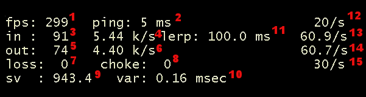

Mit dem Orangebox Update ist der net_graph 4 neu hinzugekommen. Aktiviert man diesen, kann man wesentlich mehr Server und Verbindungsinformationen auslesen, als vorher mit den net_graphen 1-3 möglich war.

Die englische Beschreibung von Valve kann man [hier](http://developer.valvesoftware.com/wiki/Source_Multiplayer_Networking#Net_graph) und [hier](http://developer.valvesoftware.com/wiki/TF2_Network_Graph) finden.

Ich werde im Folgenden versuchen, alle Werte zu erklären. 
Wenn ich dabei von ausgehnden Packeten schreibe, meine ich die Daten, die von dir bzw. dem Spiel zum Server gesendet werden. Schreibe ich von eingehenden Packeten, meine ich Datenpackete, die der Server an dein Spiel sendet.

Als erstes nochmal ein Beispielbild, bei dem ich die einzelnen Werte durchnummeriert habe:  
  

### 1.) fps

Zeigt die Bilder pro Sekunde des Clients, also die dein PCs berechnet an.

### 2.) ping

Der net_graph Ping. Er zeigt die Zeit an, die ein Datenpacket für folgenden Ablauf braucht:  

– Senden zum Server
– Verarbeitung des Datenpackets vom Server
– Zurücksenden des verarbeiteten Datenpackets

Der net_graph Ping ist immer höher als der Scorboardping. Dies liegt daran, dass der Scoreboardping die RTT (Round Trip Time) anzeigt, die Zeit für die Berechnung des Datenpackets nicht beinhaltet.

### 3.+4.) in

__(3.)__ Anzahl der eingehenden Packete in der Sekunde.  
__(4.)__ Für eingehende Packete verbrauchter Traffik in der Einheit Kilobyte pro Sekunde.

### 5.+6.) out

__(5.)__ Anzahl der zum Server gesendeten Packete in der Sekunde.  
__(6.)__ Für ausgehende Packete verbrauchter Traffik in der Einheit Kilobyte pro Sekunde.

### 7.) loss

Packetverlust in X von Hundert bei eingehenden Packeten. Die Ursache kann eine schlechte Leitung/Anbindung oder zu hoch gewählter Wert bei der Variable "rate" sein.

### 8.) choke

Packetverlust in X von Hundert bei ausgehenden Packeten. Die Ursache kann eine schlechte Leitung/Anbindung oder ein zu niedrig gewählter Wert bei der Variable "rate" sein.

### 9.) sv

Die vom Server erreichten "FPS". In der Konsole wird als Beschreibung Bilder in der Sekunde angegeben. Dies liegt daran, dass die Beschreibung vom Client angezeigt wird. Server berechnen jedoch keine Bilder in der Sekunde. Es handelt sich vielmehr um Netzwerkoperationen in der Sekunde.  
Entgegen der weitläufig vertretenen Ansicht, braucht man hier nicht X000 FPS. Ist der Wert relativ konstant und größer als 67, sollte der Server allen Ansprüchen genügen.  
Benutzt der Anbieter einen Hack umd mehr als 1000 FPS anzubieten, kann der Wert nicht richtig dargestellt werden, so dass hier irgendein Wert erscheint. Bei den FPS Hacks wird hier im Regelfall ein sehr niedriger Wert konstant angezeigt.

### 10.) var

Zeigt das Schwanken in der Dauer der Server FPS von mindesten der letzten 50 Frames. Bei Werten unterhalb von 1 ist das Schwanken so gering, dass ein optimaler Spielfluß möglich sein sollte  
Der Wert wird gelb, wenn die Server FPS kleiner als 20 und rot, wenn die Server FPS kleiner als 10 sind.

### 11.) lerp

Der Lerp ist die Länge des Interpolationsintervalles. Die Interpolation braucht man, um die Bewegung zwischen den einzelnen Updates zu schätzen. Standartmäßig sind es 20 Updates in der Sekunde. spricht alle 50ms. Die Bewegung würde ohne das Schätzen, das zwischen diesen Updates passiert, sehr rucklig aussehen.  
Deswegen rät Valve auch ausdrücklich davon ab, die Interpolation mit den Werten cl_inter_ratio 0 und cl_interp 0 abzuschalten. Statt dessen wird empfohlen, mit den Werten cl_interp_ratio 1 und cl_interp 0 zu spielen, damit sich das Interpolationsintervall wieder nach der Updaterate (cl_updaterate) richtet. In diesem Fall ist das Interpolationsintervall und damit auch der lerp cl_interp_ratio/cl_updaterate. Bei einer cl_updaterate von 66 bedeutet dies: cl_interp= 1/66= 0.0152 bzw. ein Lerp von 15,2ms. Diese Werte gebe ich auch bei meinem Config Generator vor.

Leute die euch sagen, ihr müsst unbedingt ohne Interpolation mit einem Lerp von 0 spielen, haben sich nicht die Mühe gemacht, Valves Informationen durchzulesen und somit nicht die Funktion der Interpolation verstanden. Wer es dennoch macht soll sich dann nicht beschweren, wenn andere über ihren Bildschirm ruckeln, was auf Public Servern schnell mal passieren kann.

Nun zu den einzelnen Farben des Lerps  
Sie sind sowohl von den Servereinstellungen, als auch von euren Netsetting abhängig.

__Er ist weiß:__
Wenn die Serverfps höher als cl_interp\*1000 sind und euer cl_interp Wert größer als, oder gleich 2/cl_updaterate ist. Bei den Valve standart ist dies der Fall. Hier läuft der Server mit ~270 fps, cl_interp ist 0.1 und cl_updaterate ist 20. Spricht: 270fps &gt; (0.1\*1000=100) und 0.1 &gt; (2/20=0.1)  
Bei den Standartwerten sollte ein weißer Wert in Ordnung zum Spielen sein, auch ist der Server in diesem Fall spielbar.

__Er ist gelb:__
Wenn der sv Wert, also die Server FPS niedriger, als der Lerpwert ist. Ein starkes Eibrechen der Server FPS macht sich demnach auch dadurch bemerkbar, dass die Lerpanzeige ab und zu gelb aufleuchtet.  
Ein permanentes gelbes Leuchten kann verschiedene Gründe haben. Entweder ist die Hardware mit dem Server überfordert, oder der Admin hat fps_max auf einen niedrigen Wert limitiert, um den CPU Verbrauch zu senken. Ein weiterer Grund für einen gelben Lerp kann ein Hack sein, die eingesetzt wird, um mehr als 1000 fps zu erreichen. FPS Werte oberhalb von 1000 können vom net_graph 4 nicht richtig ausgewertet werden.

__Er ist orange:__  
Wenn cl_interp kleiner als 2/cl_updaterate ist. Spricht bei einer cl_updaterate von 66 kleiner als 0.03 ist.  
Ein oranger lerp ist nicht grundsätzlich nicht schlimm. Sollte es jetzt aber bei 3 oder mehr Packeten in Folge zu Choke kommen, ist das Interpolationsintervall vorbei und ihr werdet Ruckler spüren. Bei Rucklern sollte man also nach loss und choke schauen, und die Netsettings so anpassen, dass beide nicht mehr, oder nur noch minimal auftreten.

### 12.) cl_updaterate

Der beim Client eingestellte Wert des CVARS cl_updaterate, der die Anzahl der eingehenden Weltbildupdates in der Sekunde bestimmt.

### 13.) cl_updaterate

Die tatsächlich erreichten Wert. Weicht der erreichte Wert vom eingestellten ab, kann dies verschiedene Ursachen haben.  
– Die Bandbreite (CVAR "rate") reicht nicht aus  
– Es kommt zu Packetverlust (sehbar am Wert loss)  
– Der Admin hat den minimal, oder maximal zulässigen Wert durch die server.cfg bestimmt. Beim Beispielbild ist z.B. ein Wert von 20 eingestellt, aber ein minimaler Wert von 60 erzwungen.

### 14.) cl_cmdrate

Der beim Client eingestellte Wert des CVARS cl_cmdrate, der die Anzahl der ausgehnden Weltbildupdates in der Sekunde bestimmt.

### 15.) cl_cmdrate

Die tatsächlich erreichten Wert. Weicht der erreichte Wert vom eingestellten ab, kann dies verschiedene Ursachen haben.  
– Die Bandbreite (CVAR "rate") reicht nicht aus, oder wurde es wurde ein zu hoher Wert für diese angegeben  
– Es kommt zu Packetverlust (sehbar am Wert choke)  
– Der Admin hat den minimal, oder maximal zulässigen Wert durch die server.cfg bestimmt. Beim Beispielbild ist z.B. ein Wert von 30 eingestellt, aber ein minimaler Wert von 60 erzwungen.

