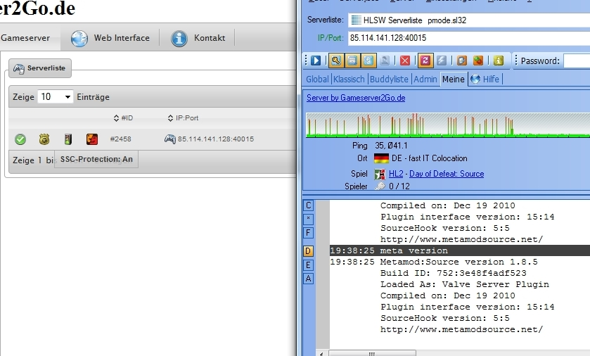
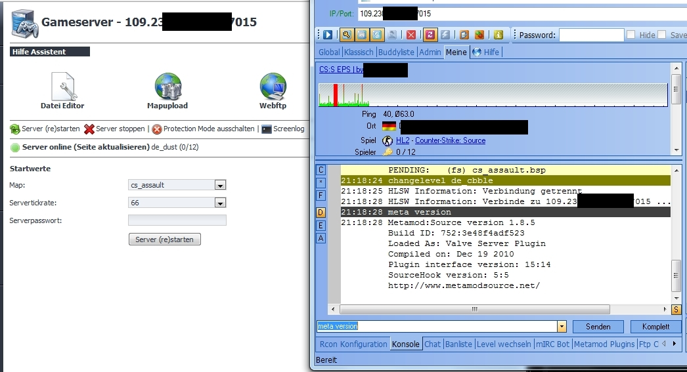

Die hier beschriebe Schwachstelle ist relativ einfach mittels FTP LIMIT Anweisungen von den Hostern bei sämtlichen Interface Lösungen abzustellen. Falls ein Interface Anbieter keine Regeln mitgeliefert hat, muss der Hoster seine Hausaufgaben selber machen. Es ist somit keine Schwäche eines Interfaces, sondern eine Nachlässigkeit von Hostern.  
Passende Regeln werden bei meinem Webinterface [Easy-Wi](https://easy-wi.com) bereits mitinstalliert, so dass es nicht von dieser Lücke betroffen sein. Darüber hinaus werden die fraglichen Dateien vor jedem Serverstart überschrieben, so dass auch auf andere Wege eingeschleuster Code nicht ausgeführt werden sollte.

Nun zum eigentlichen Thema.

Von einer großen Esport Liga angestoßen, gibt es seit einiger Zeit für Gameserver einen so genannte "Protection Modus". Als Grund für dessen Einführung wurde der vermehrte Einsatz von Serverseitigen Cheats angeführt. Merkmal eines solchen Servers soll es sein, dass er eben diese Cheats verhindert soll.

Damit der Spieler sicher sein kann, dass dieser Modus beim Hoster auch wirklich sicher ist, wurde ein Zertifikat eingeführt. Dieses Zertifikat sagt dem Verbraucher, der "Protection Modus" dieses Servers dieses Hosters sind gesichert. Es ist den Hostern überlassen, wie sie dies bewerkstelligen. Die Programmierungen dahinter sind dabei recht unterschiedlich.  
  
Mitlerweile bieten die allermeisten Hoster, egal ob sie dieses Siegel besitzen, oder auch nicht, einen solchen Modus bei ihren Servern an.  
Die Interfaces gehen in der Regel so vor, dass sie zum Kunden einen weiteren Benutzer im System haben. Oft wird mit diesem ein Server beim Start des protected Modus frisch installiert, manchmal auch nur ein extra Installation gesäubert. Im Regelfall hat der Kunde keinen, oder sehr eingeschränkten Zugang auf die Daten dieses Users.  
Deswegen sollte man meinen, dass der Server durch diese Maßnahme sicher ist.  
Zumindest bei Half-Life 2 basierenden Servern ist dies aber nicht der Fall. Man muss nicht einmal Hacken bzw. Cracken, um Servertools und damit auch Cheats nachzuladen. Man braucht lediglich einen Servercommand, den jeder Half-Life 2 basierende Server kennt. Er nennt sich "plugin_load". Dieser Servercommand sagt dem Server, er soll ein Servertool nachladen.  
Bei diesem Befehl kann man absolute Pfade angeben. Bei Windows wäre absolut beginnend ab "c:/", bei Linux beginnt man bei "/".  
Um den Absoluten Pfad bei Half-Life Servern zu erfahren, reicht ein Blick in die Logdateien. Wenn noch keine angelegt werden, kann man dies mit dem CVAR "log on" aktivieren. Gleich am Anfang werdet ihr eine Zeile finden, in der der absolute Serverpfad zu finden ist. Es ist der Eintrag in den runden Klammern hinter "game".  
>L 02/13/2011 - 18:03:03: Log file started (file "logs/L0213000.log") (game "/home/username/game/serverkennung/orangebox/dod")
 
In diesem Fall ist der absolute Pfad zum Server:  
`/home/username/game/serverkennung/orangebox/dod`

Da nun die Ordnerstruktur bekannt ist, kann man den "Protection Modus" starten, wenn er nicht ohnehin schon läuft. Man lädt jetzt seine Dateien irgendwo hin.  
Metamod ist zwar kein Cheat, aber es wird genau wie ein serverseitiger Cheat geladen und eigenet sich deshalb gut für die Demonstration.  
Bei dem Beispielserver hatte ich Metamod nach "/home/username/game/metamod/" hochgeladen. Man könnte die Dateien genauso gut in den "maps", oder "cfg" Ordner hochladen. Habt ihr, oder ein Bekannter, einen weiteren Server auf dem Host, kann man die Dateien auch in deren Ordner laden.  
Im Anschluss lockert man noch den Chmod dieser Dateien, um sicherzustellen, dass auch wirklich jeder auf diese Dateien zugreifen kann, auf CHMOD 777.

Läuft der Server, kann man die Metamod nun mit folgendem Befehl nachladen:  
`plugin_load "/home/username/game/metamod/binserver.so"`

Je nachdem, in welchen Ordner man die Dateien geladen hat, muss man den Pfad anpassen.

Ich habe diese Methode erfolgreich bei zwei Hostern mit deren Einverständnis erfolgreich getestet.  
Sehen kann man es hier:



Dass es funktioniert hat, liegt daran, dass das Problem relativ unbekannt ist und die Hoster entweder nicht informiert wurden, dass sie zusätzlich zu der Programmierung vom Webinterface noch weitere Schritte unternehmen müssen, oder es aus anderen Gründen unterlassen haben.  
Ich gehe davon aus, dass diese Methode bei vielen Hostern funktioniert. Vielleicht könnt ihr hier die Kommentarfunktion benutzen, um mitzuteilen, bei welchen Hostern dies so möglich ist.

Setzt man Proftpd als Server ein, kann man dieses Vorgehen relativ einfach unterbinden.  
Man verbietet den Usern per FTP den CHMOD Befehl auszuführen und stellt die Umask so streng ein, dass nur der hochladende User Zugriff auf die Dateien hat. Zusätzlich kann man auch noch den Schreibzugriff außerhalb des Serverordners verbieten  
```
Umask 377 277
<Directory ~/game/*>
    <Limit CHMOD RNTO RNFR STOR DELE>
        DenyAll
    </Limit>
</Directory>

<Directory ~/game/*/orangebox/*/*>
    <Limit RNFR RNTO STOR DELE>
        AllowAll
    </Limit>
</Directory>
```

Der Nachteil dieser Methode ist es, dass bei manchen Webinterfaces so auch keine Maps und Configs mehr hochgeladen werden können. Es muss also jeder Hoster für sich schauen, wie er das Problem für sich löst.

