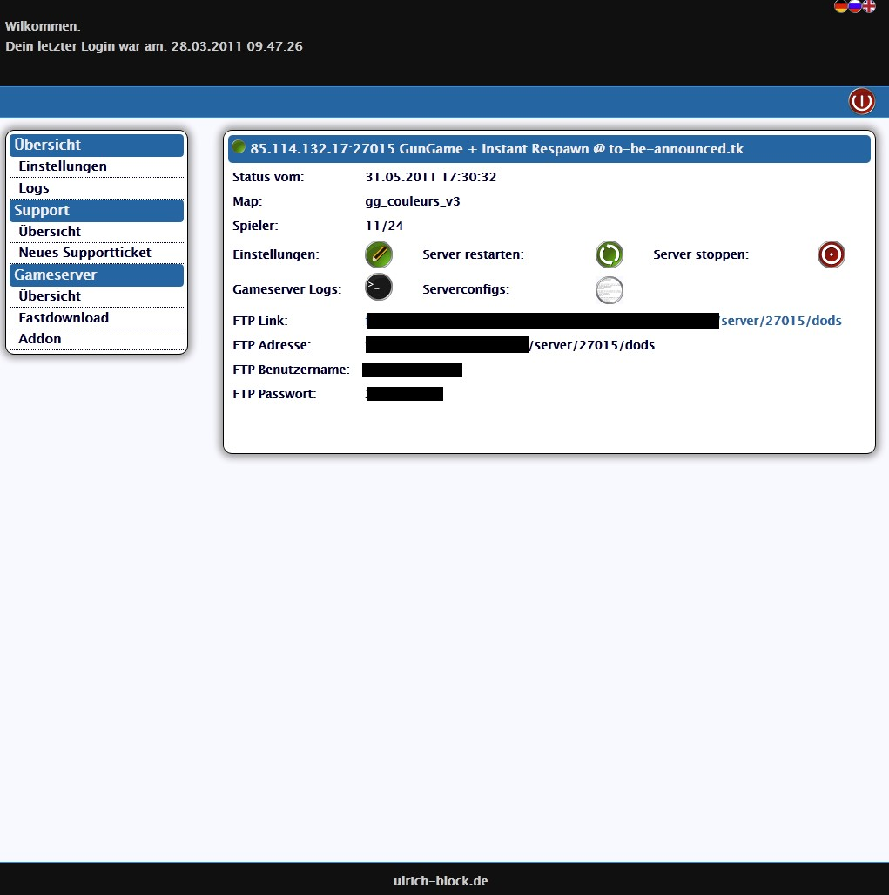
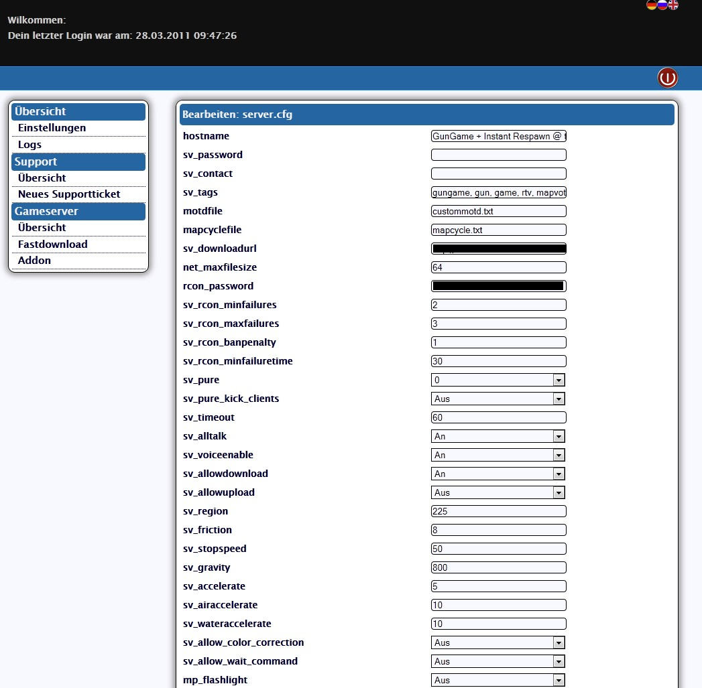
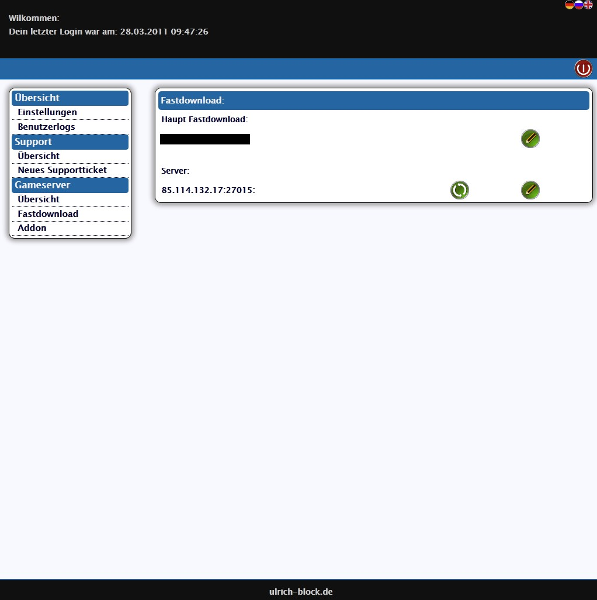
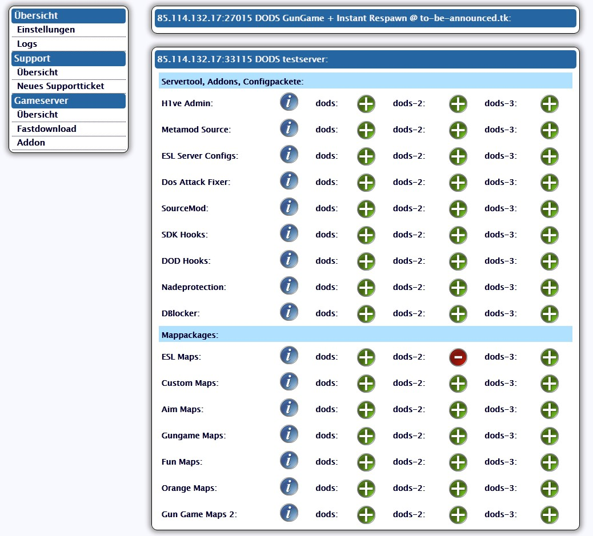

Im letzten [Beitrag](/gameserver-webinterface/) habe ich einen Teil der Adminoberfläche meines Webinterface vorgestellt.

Heute möchte ich euch einen kleinen Einblick in die Benutzerseite geben.

Die Gameserverübersicht sieht wie folgt aus:  

Der Serverstatus ist nicht 100% aktuell, sondern wird aus der Datenbank ausgelesen, welche durch einen Cronjob aktuell gehalten wird. Dieser Cronjob hat als weitere Aufgabe, abgestürzte Server neu zu starten. Zum einen ist der Seitenaufbau deutlich schneller, zum anderen verhindert es so, dass unzählige Anfragen geschickt werden, wenn ein Skript fehlerhaft, oder absichtlich falsch ausgeführt wird. Die Uhrzeit und das Datum des letzten Statusupdates wird im Panel angezeigt.

Der Zugangsdaten für den FTP Zugriff sind in der Übersicht hinterlegt. Ein Direktlink in den jeweiligen Unterordner ist auch vorhanden.

In den Einstellungen des Gameserver kann man den automatischen Neustart konfigurieren, das Spiel wechseln und den Server neu installieren, bzw. fehlende Dateien nachtragen lassen, falls man aus Versehen welche gelöscht haben sollte.  
  
Man kann die Configs aus dem Panel heraus editieren. Dabei einmal in einem Editor und zum anderen in einem Formular. Bei letzterem wird die Config geparst und man muss nur noch die Werte zu den CVars eingeben:  

Wenn man über einen Fastdownload für Custom Content verfügt, kann man dessen Daten im Webinterface hinterlegen. Per Knopfdruck werden die Dateien dann auf den Fastdownload Webspace hochgeladen. Ist eine Komprimierung möglich, wie z.B. bei Spielen der Half-Life 2 Serie, zu der auch Counter-Strike: Source gehört, werden die Dateien vorher komprimiert:  

Das Hinzufügen und Löschen von Addons und Mappaketen ist auch relativ einfach gehalten. Auch hier werden grundsätzlich nur Symlinks erstellt. Die Ausnahme bilden Dateien, die der User editieren muss.  
Ein Mappaket von 4GB installiert sich auf diese Weise binnen weniger Sekunden. Wenn der Admin Informationen zu dem Paket hinterlegt hat, kann der User diese mittels des Info Buttons einsehen:  

