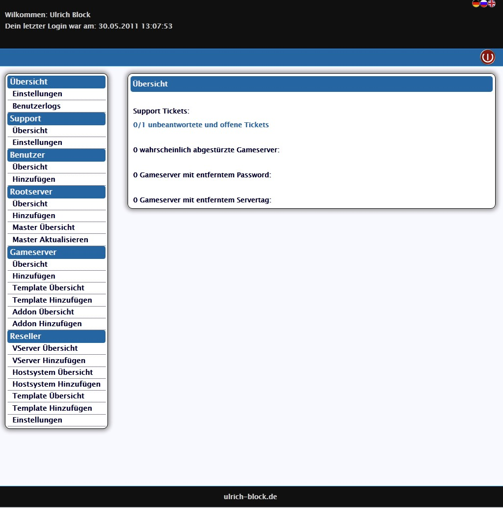
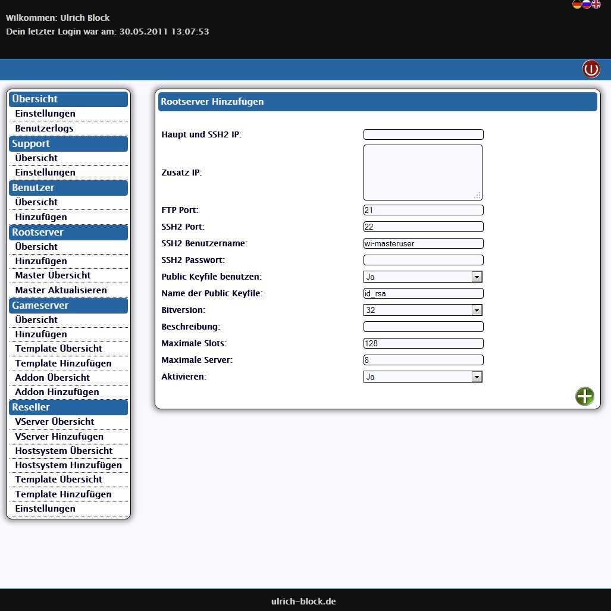
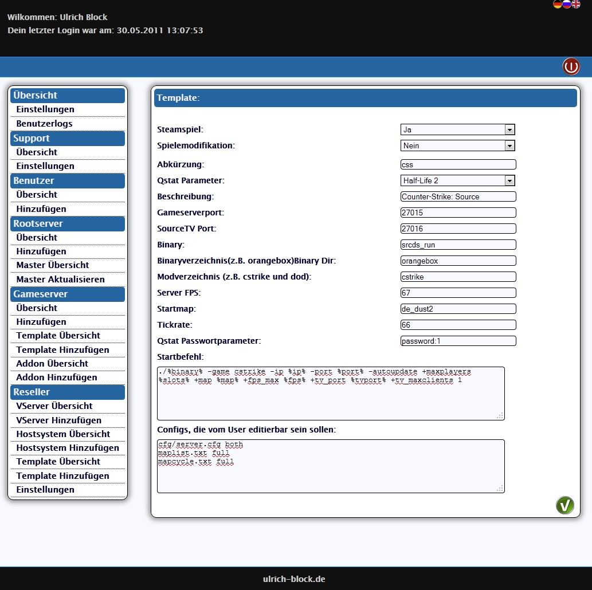
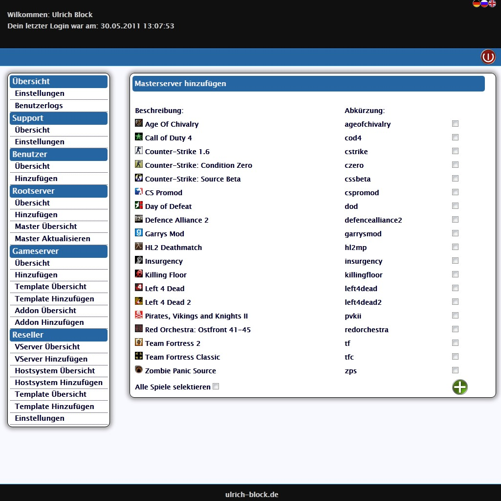
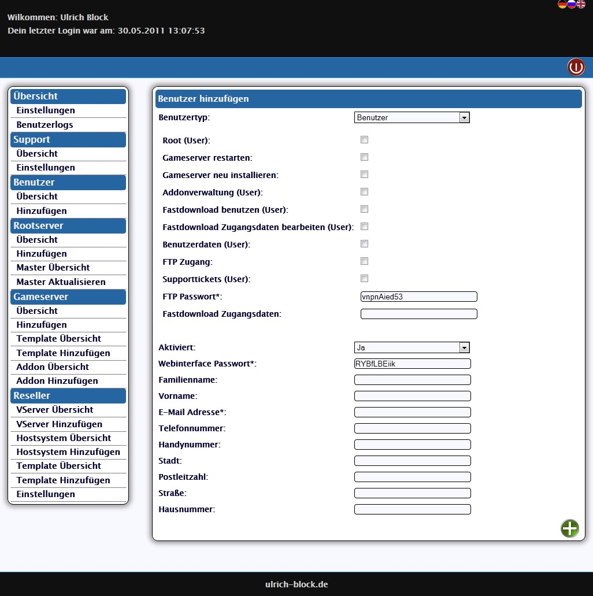
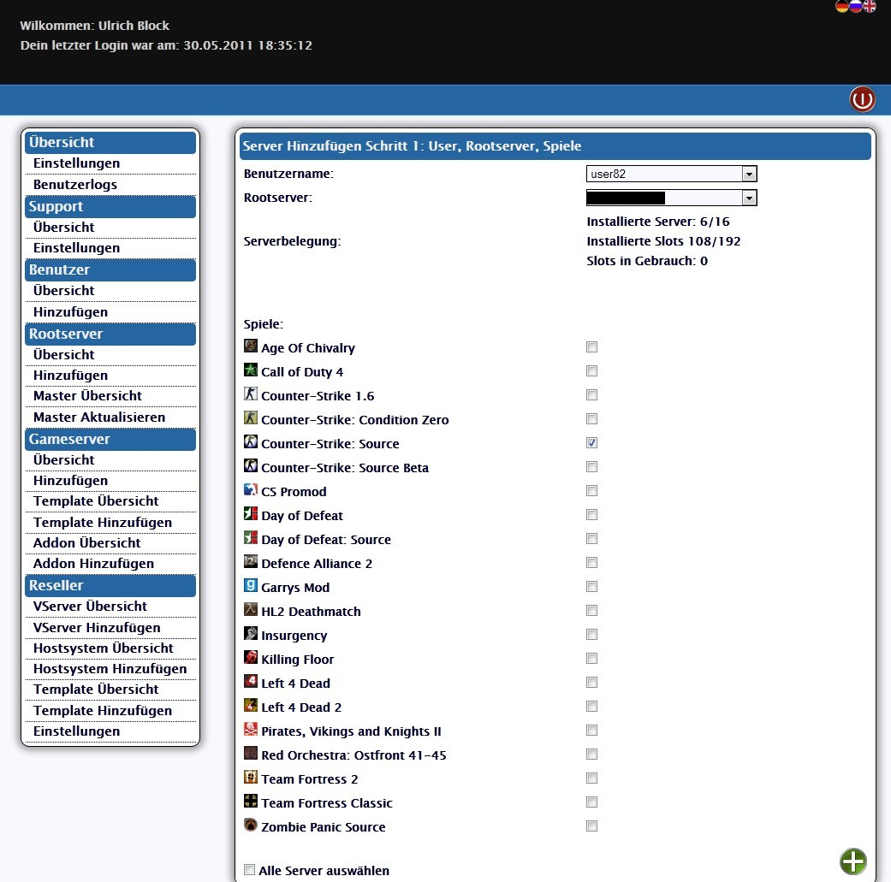
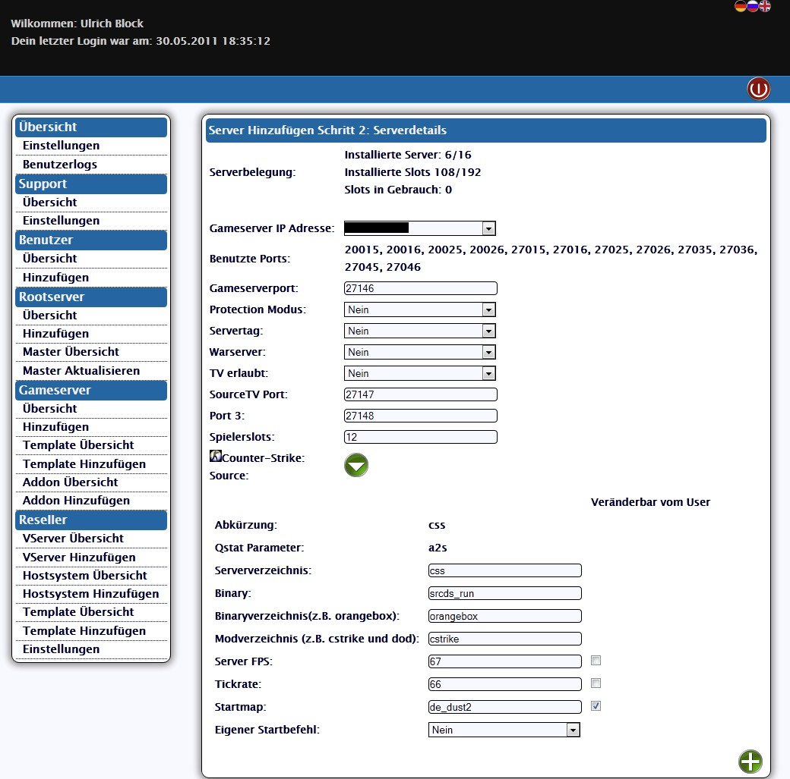
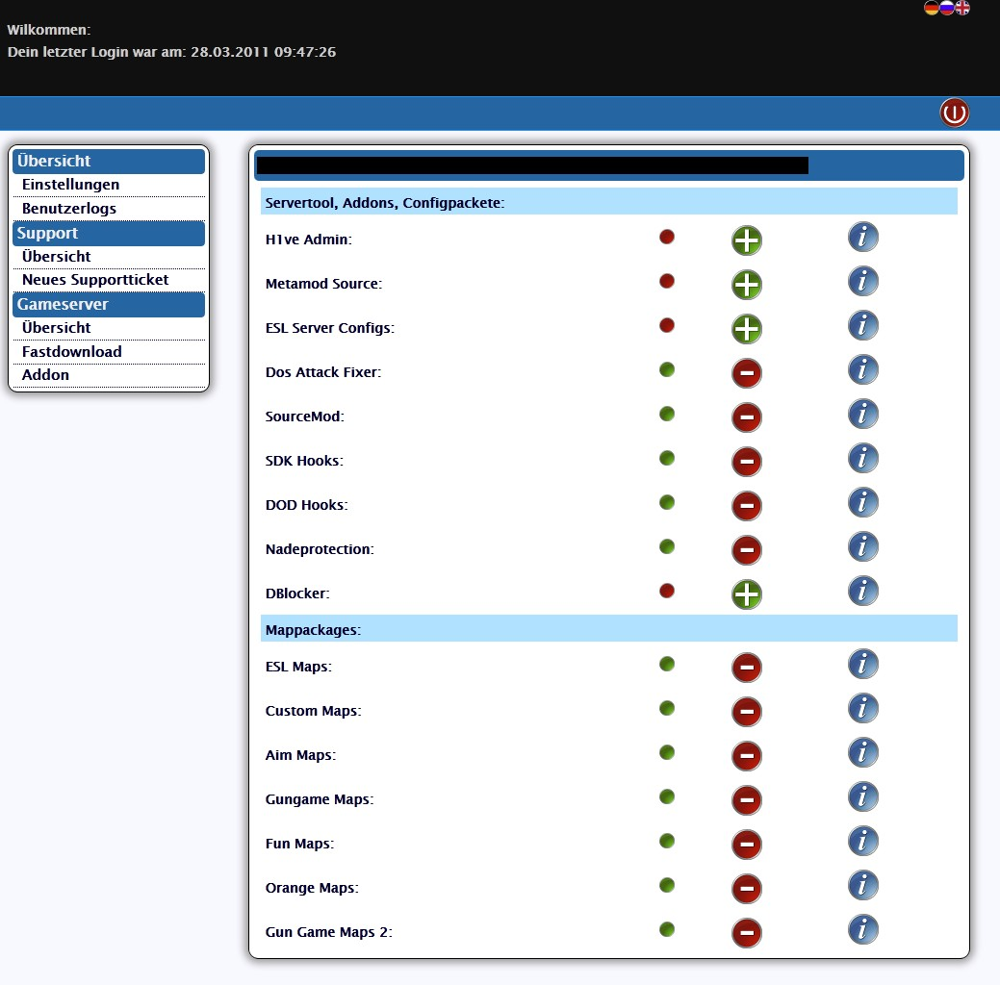

In letzter Zeit bin ich nicht so viel zum Bloggen gekommen. Das lag daran, dass ich damit beschäftigt war, an meinem Interface zu arbeiten, dass nicht nur Gameserver unterstützen wird. An den bestehende Lösungen gibt es zahlreiche Sachen, die mich stören. Zum einen halte ich manches für nicht sinnvoll, zum anderen, ist mein Geschmack anders.  
Ausreichend getestet ist es derzeit für Half-Life 1 und Half-Life 2 basierende Server wie z.B. Counter-Strike und Counter-Strike: Source. Andere Serverarten wie z.B. die der Call of Duty Reihe sollten ebenfalls problemlos unterstützt werden.

Ich hatte Anfangs versucht Teklab durch Modifikationen und Erweiterungen auf meine Bedürfnisse anzupassen. Ich bin dann zu der Ansicht gekommen, dass ich lieber alles selber machen möchte, um nicht auf Dritte angewiesen zu sein.

Das Ergebnis ist ein Interface, das bis jetzt noch ohne Namen ist. Es wird streng zwischen Sprachdateien, Templates und PHP getrennt. Dabei ist das Webinterface mehrsprachig geschrieben. Derzeit werden, Deutsch, Englisch und Russisch unterstützt. Man kann schnell und einfach mittels .xml Dateien neue Sprachen hinzufügen. Sollte man einmal eine Sprachdatei noch nicht übersetzt haben, dann wird die Datei der einstellbaren Standardsprache genutzt.

Das Design ist schlicht gehalten. Bis auf ein paar Icons ist alles mit CSS realisiert. Am Design und den Icons sieht man leider, dass ich zwar Coden, aber nicht besonders Designen kann.

Im Gegensatz zu den bestehenden frei erhältlichen Lösungen werden Symlinks an Stelle von Dateien eingesetzt. Die Ausnahme davon sind Dateien, die der User editieren muss. Der User hat demnach Ordner, viele Links und ein paar Dateien.  
Durch den Einsatz von Symlinks ist eine Serverinstallation im Regelfall weniger als 1MB groß. Dass das Anlegen eines solchen Servers bedeutend schneller geht, als das eines vollständigen Servers, kann man sich denken.  
Bei Updates hat der Einsatz der Symlinks auch große Vorteile. Es müssen nur die Dateien aktuell gehalten werden, auf die verlinkt wird. Demnach fällt pro physikalischem Server nur ein Update pro Spiel an.  
Diese Updates können sowohl automatisiert, als auch manuell gestartet werden.

Sowohl der Admin, als auch der User kann die jeweiligen Installationen jederzeit neu installieren, oder nur Dateien nachtragen lassen, die er aus Versehen gelöscht hat.

Mit Hilfe von Cron kann überprüft werden, ob Server noch laufen. Ist dieses nicht der Fall, werden sie von selber neu gestartet.

Im Folgenden ein paar Bilder aus dem Adminbereich.  
  
Nach dem Einloggen sieht man sofort, ob es Probleme gibt:  

Neue Systeme kann man über diese Eingabe hinzufügen:  

Damit man Gameserver anlegen kann, muss man im ersten Schritt ein Template erstellen:  

Im zweiten Schritt installiert man dann den Masterserver, auf den die einzelnen Gameserver verlinkt werden anlegen:  

Damit man einzelne Server anlegen kann, muss man noch einen User anlegen. Bei diesem Vorgang werden Passwörter generiert und vorgegeben. Man kann aber auch eigene verwenden:  

Jetzt kann man einzelne Gameserver anlegen. Beim Anlegen, werden einem freie Ports vorgeschlagen und bereits belegte Ports ebenso wie die Belastung des Systems angezeigt:  
  

Addons und Mappacks können sowohl für eine ganze Serverart, als auch für ein einzelnes Spiel genutzt werden. Diese Funktion ist insbesondere bei Plugins und Tools von Nutzen, die auf verschiedenen Servern laufen. Beispiele hierfür sind Metamod, Sourcemod, Sourcemod Plugins, usw.  

