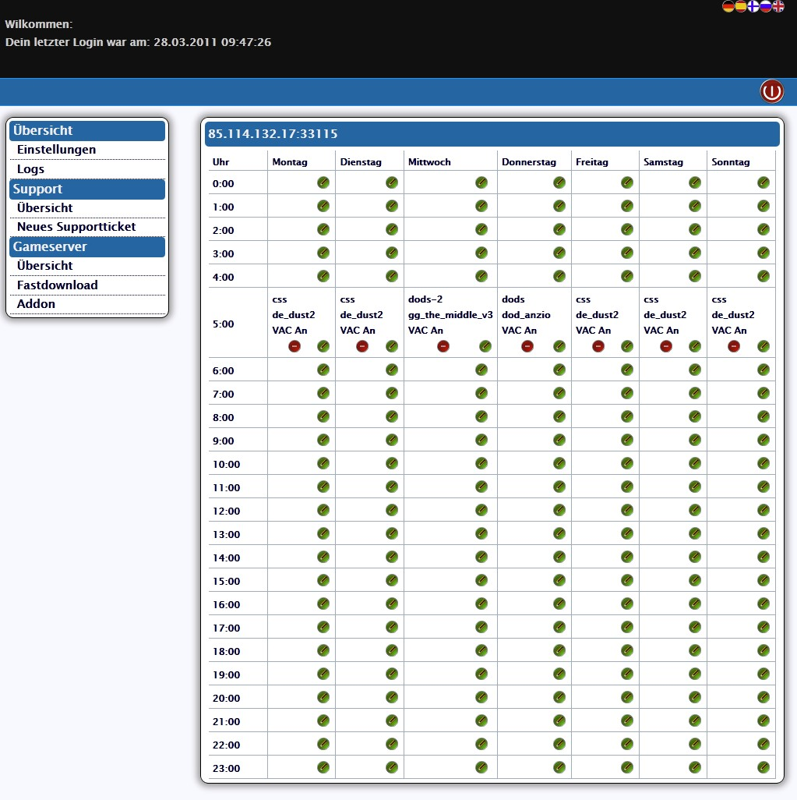
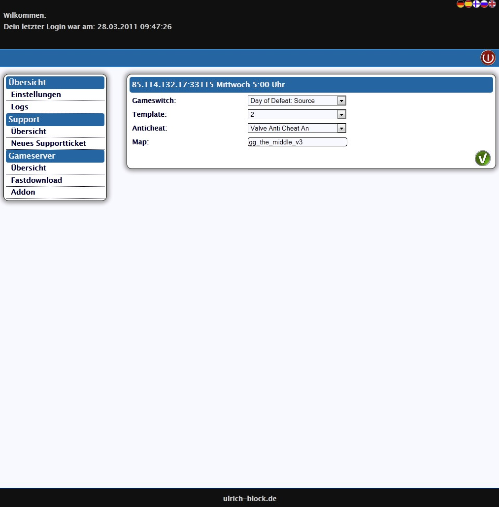

Ich möchte mit diesem Artikel weitere Funktionen meines Webinterfaces vorstellen. In vielen Fällen möchte man automatische Restarts planen. Zu diesem Zweck gibt es einen Restartplaner, dessen Übersicht wie folgt aussieht:

Beim Erstellen und Modifizieren von Restarts hat man folgende Maske:

Man kann folglich einstellen, mit welcher Map, welches Spiel, sofern die Option "Gameswitch" installiert wurde, und welches "Template" gestartet werden soll.

Damit kommen wir zum nächsten Feature des Webinterfaces. Pro Spiel und Port werden 3 Installationen angelegt, die ich als "Template" bezeichne. Die Ordnerstruktur ist dabei immer:

> server/port/spielkürzel/  
> server/port/spielkürzel-2/  
> server/port/spielkürzel-3/

Dies gibt dem Benutzer die Möglichkeit, verschiedene Servereinstellungen zu erstellen, die er dann bei Bedarf laden kann. Auch das Testen von neuen Einstellungen kann so vorgenommen werden. Erst wenn man in seiner Testumgebung das gewünschte Ergebnis erreicht hat, überträgt man es auf die Produktive.

Ein weiterer möglicher Einsatzbereich der Templates ist z.B. bei War Servern und unterschiedliche Einstellungen für unterschiedliche Ligen. In dem Fall richtet man jedes Template passend für eine Liga ein und wechselt je nach Bedarf durch.

Die Templates kann man sowohl über den Restartplaner steuern, als auch manuell in den Servereinstellungen.

