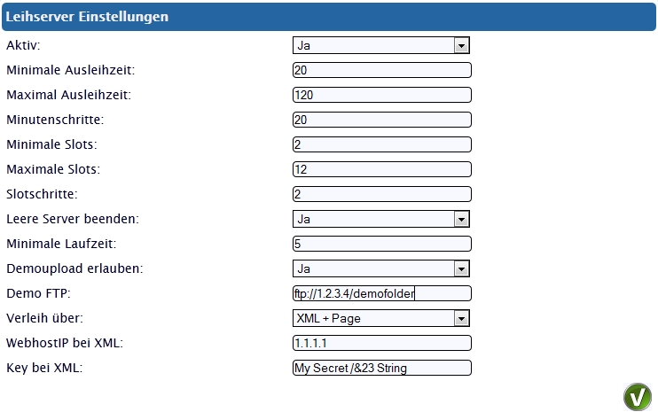
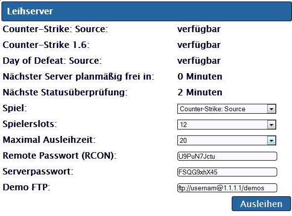
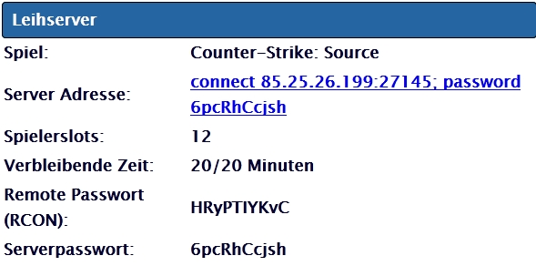

Ich habe gestern ein größeres Update für mein Webinterface [easy-wi.com](https://easy-wi.com) veröffentlicht. Eine der größeren Neuerungen ist das Gameserver Verleihmodul.

Ist das Spiel in der Lage, Demos aufzunehmen, so besteht die Option, die Demos in komprimierter Form auf einen Webspace zu transferieren.

Durch die Erweiterung kann man nun beim Anlegen und Editieren von Gameservern bestimmen, ob dieser verleihbar ist.  
Wenn man das Verleihmodul dann aktiviert und konfiguriert, gibt es zwei Wege die Gameserver zu verleihen. Zum einen kann über das mitgebrachten Formular ausgeliehen werden. Zum anderen kann eine externe Seite über die XML Schnittstelle den Verleih an die Benutzer verwalten. Dies kann man sowohl alternativ, als auch beides Gleichzeitig nutzen.

Dadurch, dass man mehrere Spiele je Port und User installieren kann, kann man für eine relativ hohe Verfügbarkeit verschiedener Spiele sorgen, ohne all zu viel Leerstand zu haben.

Die Einstellungen, welche Rahmenbedingungen für den Verleih gelten sollen, sind relativ einfach gemacht:  

Wird das Formular aufgerufen, so wird dem Benutzer folgende Seite angezeigt:  

Nachdem man seine Auswahl getroffen hat muss nur noch auf "Ausleihen" geklickt werden. Wenn noch ausreichend Server verfügbar sind, wird nun einer gestartet und die Zugangsdaten dem User dargestellt:  

