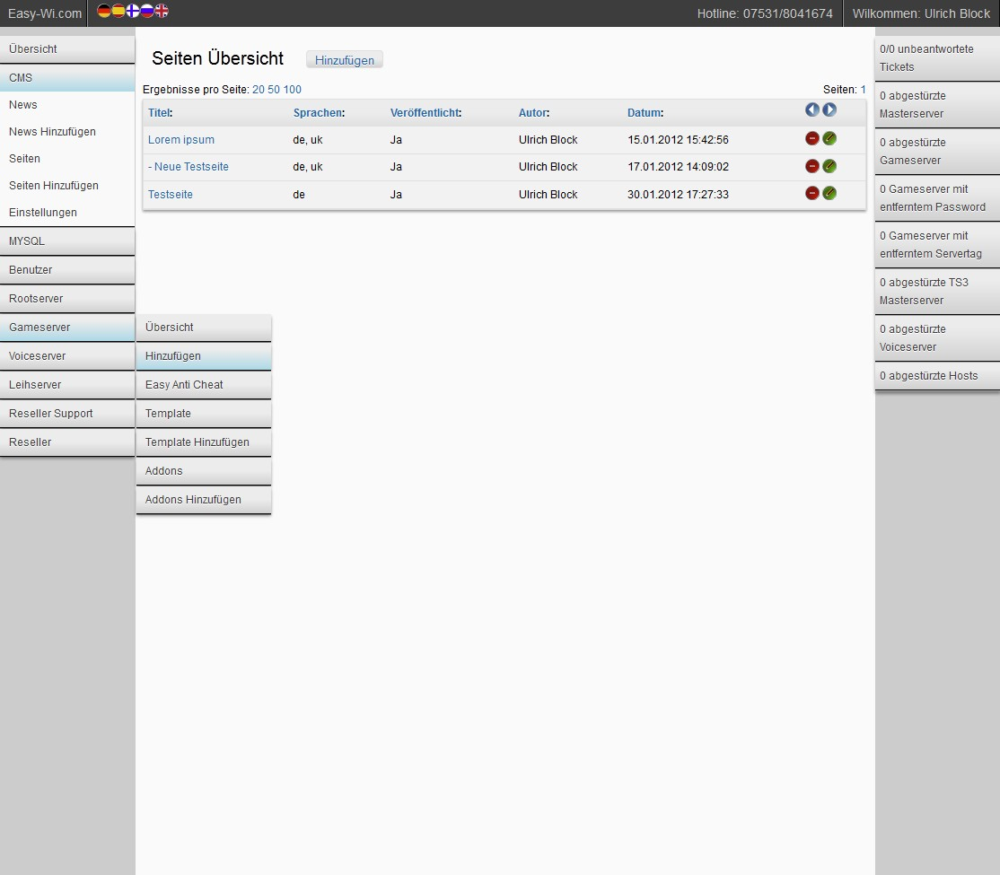

Ich möchte einen kleinen Einblick auf die kommende Version meines Webinterfaces [Easy-Wi](https://easy-wi.com) geben. Es wird zwei wesentliche Neuerungen geben.

Zum einen arbeite ich gerade mit Hochdruck an einem CMS. Heutzutage selbstverständliche Funktionen, wie Rewrite Urls und Mehrsprachigkeit, werden selbstverständlich unterstützt. Setzt man Rewrite Urls ein, kann man Links wie *domain.tld/de/Leihserver*/, oder *domain.tld/uk/Lendserver/Gameserver/* benutzen.  
Keywords können je Artikel oder Seite gesetzt werden.  
Seiten, wie die Verleih- und Protectionmodeseite, die bereits losgelöst vom CMS bestanden haben, sind ebenfalls mit von der Partie.

Die zweite Neuerung ist das Layout der Adminoberfläche. Die Menüführung wurde komplett überarbeitet und sollte die Arbeitsabläufe beschleunigen.

Beim Hover über das Menü wird das jeweilige Untermenü eingeblendet. Sobald man in einem Unterbereich arbeitet, wird die Subnavi zu diesem Bereich, die vorher nur über Hover erreichbar war, unterhalb der Überschrift des Bereiches aufgeklappt und permanent angezeigt. Sobald man den Bereich wieder verlässt, wird das zugehörige Untermenü wieder ausgeblendet.  
Durch die neue Struktur kann ich wesentlich mehr Menüelemente einbauen, ohne dass es unübersichtlich wird.

Des Weiteren gibt es nun Rechts eine Übersicht, die bei Events, also Anzahl der Einträge größer als 0, farblich hervorgehoben wird. Es wird demnach beim Arbeiten sofort farblich ins Auge stechen, wenn man sich um etwas kümmern sollte.

Insgesamt habe ich versucht, durch Schattenwürfe, Trennlinien und Farbverläufe das Layout etwas aufzulockern.

Der derzeitige WIP Status sieht folgendermaßen aus:  

