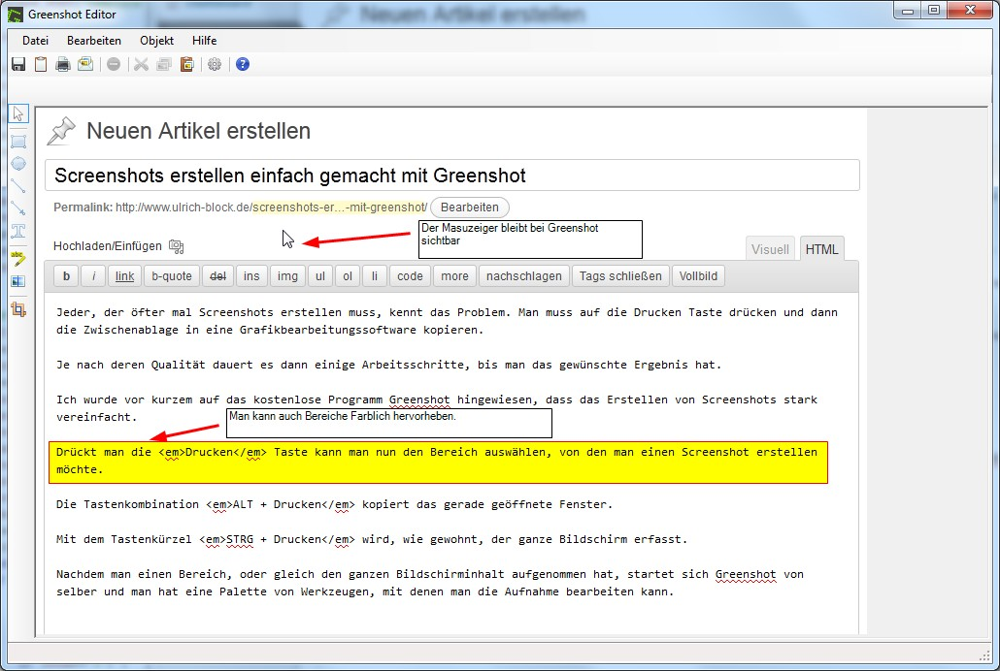

Jeder, der öfter mal Screenshots erstellen muss, kennt das Problem. Man muss auf die Drucken Taste drücken und dann die Zwischenablage in eine Grafikbearbeitungssoftware kopieren.

Je nach deren Qualität dauert es dann einige Arbeitsschritte, bis man das gewünschte Ergebnis hat.

Ich wurde vor kurzem auf das kostenlose Programm [Greenshot](http://getgreenshot.org) hingewiesen, dass das Erstellen von Screenshots stark vereinfacht.

Drückt man die *Drucken* Taste kann man nun den Bereich auswählen, von den man einen Screenshot erstellen möchte.

Die Tastenkombination *ALT + Drucken* kopiert das gerade geöffnete Fenster.

Mit dem Tastenkürzel *STRG + Drucken* wird, wie gewohnt, der ganze Bildschirm erfasst.

Nachdem man einen Bereich, oder gleich den ganzen Bildschirminhalt aufgenommen hat, startet sich [Greenshot](http://getgreenshot.org) von selber und man hat eine Palette von Werkzeugen, mit denen man die Aufnahme bearbeiten kann.

Die Benutzeroberfläche sieht folgendermaßen aus:  

