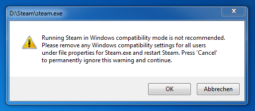

Nach einem der letzten Steam Updates konnte ich bei jedem Start von Steam folgendes lesen:

> Running Steam in Windows compatibility mode is not recommended.  
> Please remove any Windows compatibility settings for all users  
> under file properties for Steam.exe and restart Steam. Press ‚Cancel‘  
> to permanently ignore this warningand continue.

Die Warnung sah so aus:  

Weder beim Link, noch bei der Steam.exe selber, war die Option aktiviert. Die Einstellung war in der Registry zu suchen und zu löschen:

- Windows Start Button
- Ausführen bzw. Programme/Dateien suchen
- regedit eingeben und ausführen
- HKEY_CURRENT_USER\\Software\\Microsoft\\Windows NT\\CurrentVersion\\AppCompatFlags\\Layers suchen
- Den Eintrag suchen, der zum Pfad der Steam.exe führt
- Den Eintrag löschen
- Steam neu starten

