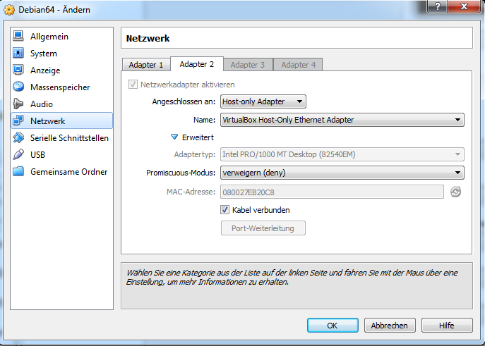

[VirtualBox](https://www.virtualbox.org/) ist ein großartiges Programm, um lokale Testserver einzurichten. Mit wenigen Mausklicks ist ein neuer Gast angelegt und die Installation des Betriebssystems kann über ein ISO, oder direkt von einer CD/DVD/BL beginnen.

Möchte man Serverdienste testen steht man jedoch vor einem Problem. Der Guest hat keine eigene IP im Netzwerk und man kann die jeweiligen Deamons nicht erreichen.

Die Lösung ist simpel und hat 6 Schritte.

## 1. Gast stoppen
Befindet man sich auf der Konsole, gibt man folgendes ein:  
`shutdown -h now`

## 2. Adapter 2 konfigurieren

In den Netzwerkeinstellungen des Gastes aktiviert man den zweiten Adapter. Die Einstellungen sind:  
Angeschlossen an: Host-only Adapter  
Name: VirtualBox Host-Only Ethernet Adapter

Das Ganze sollte dann so aussehen:  


## 3. Gast starten

Nachdem das neue Netzwerk Device aktiviert wurde, kann der Gast gestartet werden.

## 4. /etc/network/interfaces erweitern

Nun die Config /etc/network/interfaces erweitern um folgende Zeilen erweitern:

```
allow-hotplug eth1<br></br>iface eth1 inet dhcp
```

## 5. Gast Neu Starten

Nachdem die Änderung gesichert wurde, starten wir den Gast neu:  
```bash
shutdown -r now
```

## 6. Änderungen überprüfen

Sobald der Gast wieder hochgefahren ist, können wir die LAN IP anzeigen lassen, unter der wir den Gast erreichen können:  
```bash
ifconfig eth1
    eth1 Link encap:Ethernet HWaddr 08:00:27:eb:20:c8
    inet addr:192.168.56.101 Bcast:192.168.56.255 Mask:255.255.255.0
    inet6 addr: fe80::a00:27ff:feeb:20c8/64 Scope:Link
    UP BROADCAST RUNNING MULTICAST MTU:1500 Metric:1
    RX packets:32068 errors:0 dropped:0 overruns:0 frame:0
    TX packets:59529 errors:0 dropped:0 overruns:0 carrier:0
    collisions:0 txqueuelen:1000
    RX bytes:2006958 (1.9 MiB) TX bytes:11321654 (10.7 MiB)
```

Etwaige Serverdienste wie z.B. ein SSH Deamon, können nun unter der IP, die unter inet addr angegeben ist, erreicht werden. Im Beispiel wäre es dann 192.168.56.101.

