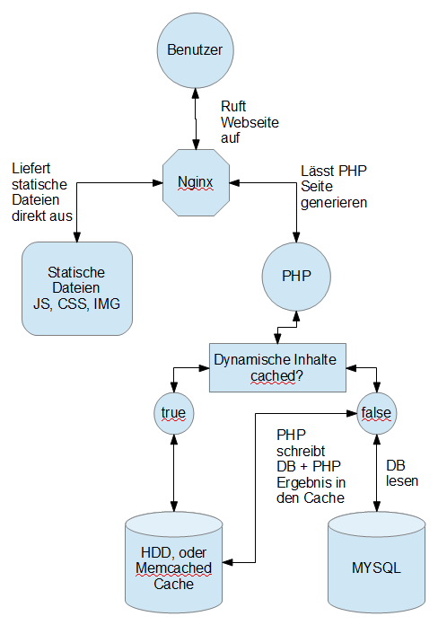
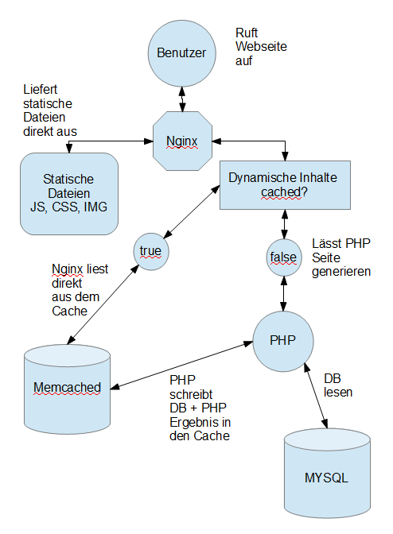

Warum es aus SEO und Marketinggründen so wichtig ist, eine schnelle Webseite zu haben kann man bei folgenden Links nachlesen:

- [Using site speed in web search ranking](http://googlewebmastercentral.blogspot.de/2010/04/using-site-speed-in-web-search-ranking.html "Using site speed in web search ranking")
- [Interview mit Matt Cutts](https://www.youtube.com/watch?v=dQkPhw5n4ZE "Interview mit Matt Cutts")
- [Speed Kills Conversion Rates](http://www.getelastic.com/site-speed-infographic/)

Wie Goolge deinen Pagespeed bewertet kann man unter [developers.google.com](http://developers.google.com/speed/pagespeed/insights/) überprüfen.

In dem früheren Beitrag [WordPress beschleunigen mit Wp Redis Cache](/wordpress-beschleunigen-mit-wp-redis-cache/) habe ich beschrieben, wie man Fullpage Caching des WordPress Blogs mit der In-Memory Datenbank bzw. Key Value Store **Redis** betreiben kann. Alternativ zu **Redis** wird oft auch **Memcached**, oder die Festplatte genutzt. Das Ziel ist immer das gleiche. Der ansonsten nicht sehr schnelle Aufruf einer WordPress Seite soll beschleunigt werden. Erreicht wird das Ziel dadurch, dass beim Ausliefern der gecachten Inhalte der WordPress Core und damit auch MYSQL nicht mehr angefragt werden.

Je nach Server und Belastung ist dabei die Festplatten oder die In-Memory Lösung besser geeignet. Letztere ist leider nur möglich, wenn man selber Herr über den Server ist. Insbesondere bei fertigem Webspace kommt nur HDD Caching in Frage.  
Wird eine In-Memory Datenbank genutzt, schaltet man den Flaschenhals Festplatte ab. Vorausgesetzt wird natürlich ein ausreichend großer Ram.

Bei diesem Cache Konzept werden nach wie vor zahlreiche Verbindungen, File Handler und Sockets geöffnet. Im Schaubild nicht inbegriffen sind Ausführungen über Nameserver und TCP Connections:  

Bei diesem Konzept fragt der Webserver bei PHP an, welches dann nach gecachten Inhalten sucht bzw. diese anlegt. Dabei geht natürlich Zeit verloren, wenn der Webserver bei PHP und PHP dann bei dem Cache anfragt.

Ziel sollte es deswegen sein, den Zwischenschritt PHP auszulassen, wenn es bereits gecachte Inhalte gibt. Bei Nginx ist das Memcached Modul im Standard dabei, eine Redis Connector müsste erst als Third Party Modul in den Nginx kompiliert werden. Die Stabilität im Live Betrieb ist dabei dabei ungewiss. Aus diesem Grund sollte man lieber auf die In-Memory Datenbank Memcached setzen.

Nun ist folgendes Konzept möglich:  

Der Nginx öffnet bei der Useranfrage einen Socket zum Memcached Server und liefert gecachte Inhalte direkt aus dem Ram aus. Langsamere Festplattenzugriffe sind nicht mehr nötig. Ebenso wenig ist PHP bei bereits gecachten Inhalten involviert.  
Falls eine Datei nicht im Cache gefunden werden kann, wird der normale PHP + MYSQL Prozess von WordPress durchlaufen und zusätzlich zur Ausgabe an den User das Ergebnis in die Memcached Datenbank geschrieben.

Bei meinem Blog konnte ich die Ladenzeiten im Vergleich zu Konzept 1 dadurch im Optimum fast halbieren. Im Mittel wurde die Ladezeit um 1/3 gesenkt.

