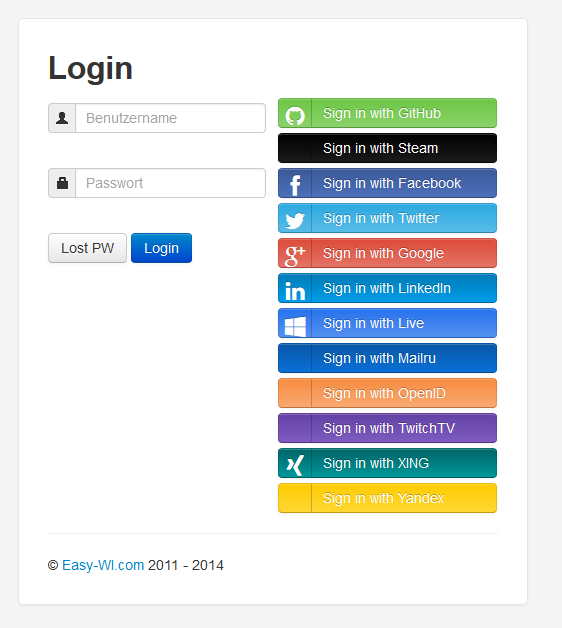

Die Zeiten der Insellösungen bei Software ist definitiv vorbei. Moderne Software ist meist nur noch ein Bestandteil einer größeren Softwarecloud bzw. Softwareverbundes. Software ohne API und Schnittstellen wird im Web mittel- und längerfristig wohl aussterben bzw. stark zurück gehen.

Im Backendbereich wird dies oft über REST und SOAP, JDBC usw. geregelt. Davon kriegt der User in der Regel aber nichts mit.

Ein Beispiel im Frontend, dass der User immer öfter sehen kann, ist das so genannte Social Auth. Bei vielen modernen Seiten und Programmen kann man Buttons mit "Registrieren mit Facebook", "Login mit Facebook", "Registrieren mit Twitter", "Login mit Twitter", usw. sehen.

Klickt man darauf, dann wird der User auf Facebook geleitet, welches dann den Login durchführt und der anderen Webseite mitteilt, dass der User sich eingeloggt hat.

Bei der Registrierung auf einer Seite bzw. Programm mit Facebook Teilt Facebook nach Erlaubnis durch den User der Seite bzw. Programm die Userdaten mit.

Der so genannte Social Auth wird dabei mit standardisierten Verfahren abgewickelt. Diese nennen sich z.B, OpenID und OAuth.

Es war schon lange geplant, Social Auth bei Easy-WI zu integrieren. Leider ist dies an dem Faktor Zeit gescheitert. Nun habe ich ein paar Stunden gefunden und die PHP Klasse Hybridauth eingebunden. Social Auth ist nun mit dem Login von Facebook, Github, Steam, Twitter, Google-Plus, LinkedIn, Live, Mail.ru, OpenID, Twitch.tv, Xing und Yandex.ru möglich:  

