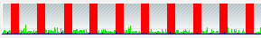
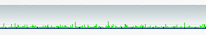

Wer seinen Counter-Strike Global Offensive Server mit HLSW verwalten will, wird seit den letzten Updates in aller Regel viele rote Timeouts aka rote Balken sehen:

Sie entstehen dadurch, dass Schutzmaßnahmen im Bereich DOS, DDOS undamplified DDOS ergriffen wurden. Oder anders: Es wurde die maximal zulässige Anzahl von Statusquerys in der Sekunde limitiert.

Damit es zu keinen roten Balken bei HLSW mehr kommt, kann man das Limit der zulässigen Querys in der Sekunde anheben. Dies macht man mit dem Config Variable *sv_max_queries_sec*. Setzt man diese auf 6 Sekunden, verschwinden die roten Balken, aka Timeouts auf Kosten des Schutz gegen DOS/amplified DDOS:  
`sv_max_queries_sec 6`  

Wer dann noch wieder die Playerliste und Serverdetails sehen möchte fügt noch folgendes in die server.cfg ein:  
`host_info_show 2host_players_show 2`

Alle diese Befehle steigern natürlich die Gefahr, dass man für eine amplified DDOS Attacke ausgenutzt wird.

