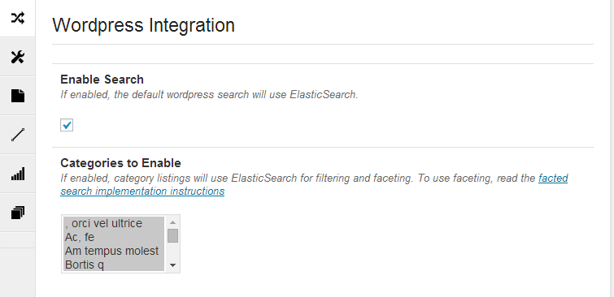
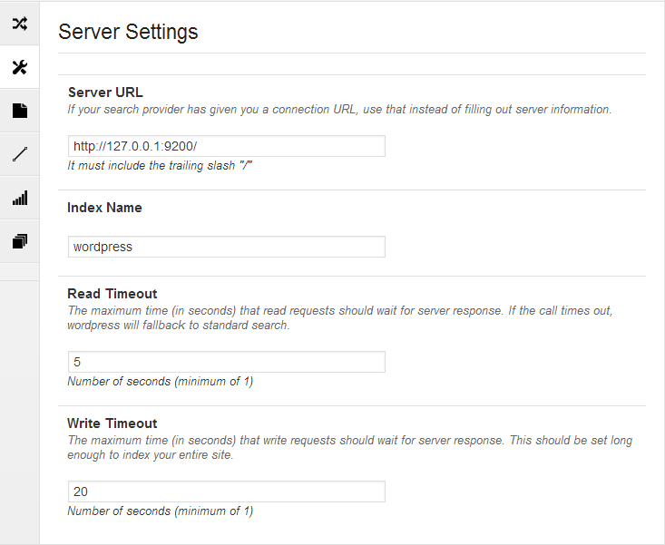
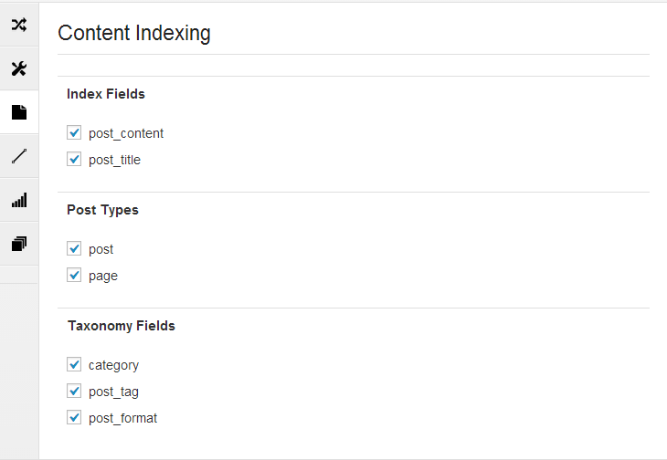
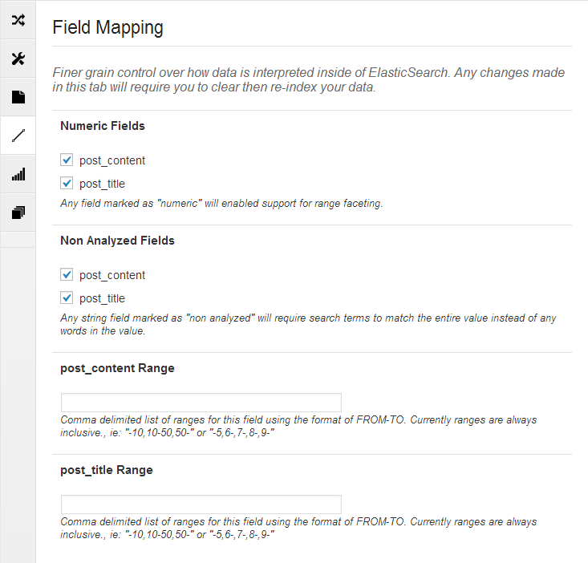

### Elasticsearch installieren

Für Debian werden fertige Pakete mittels APT angeboten. Die [Installation](http://www.elasticsearch.org/guide/en/elasticsearch/reference/current/setup-repositories.html) bedarf vierer Schritte

```bash
wget -O - http://packages.elasticsearch.org/GPG-KEY-elasticsearch | apt-key add -
echo "deb http://packages.elasticsearch.org/elasticsearch/1.2/debian stable main" > /etc/apt/sources.list.d/elasticsearch.list
apt-get update
apt-get install openjdk-7-jdk elasticsearch
update-rc.d elasticsearch defaults 95 10
/etc/init.d/elasticsearch start
```

Nach der Installation lauscht Elasticsearch noch auf allen Interfaces. Es reicht eine Erreichbarkeit über den Lokalhost. Deswegen in der Datei /**etc/elasticsearch/elasticsearch.yml** folgende Einträge vornehmen:  

```
network.bind_host: 127.0.0.1
network.publish_host: 127.0.0.1
network.host: 127.0.0.1
http.port: 9200
```

### Fantastic Elasticsearch

Damit WordPress mit dem Elasticsearch Server kommuniziert, installieren wir das Plugin [Fantastic Elasticsearch](http://wordpress.org/plugins/fantastic-elasticsearch/).

Nach der Installation kommt die Konfiguration. Hier einmal meine Einstellungen:  









### Alle Teile dieser Serie

- [WordPress unleashed: Konzept](/wordpress-unleashed-konzept/ "Wordpress unleashed: Konzept")
- [WordPress unleashed: Testsystem](/wordpress-unleashed-testsystem/ "Wordpress unleashed: Testsystem")
- [WordPress unleashed: LEMP Stack](/wordpress-unleashed-lemp-stack/ "Wordpress unleashed: LEMP Stack")
- [WordPress unleashed: Datenbank + WordPress](/wordpress-unleashed-datenbank-wordpress/ "Wordpress unleashed: Datenbank + WordPress")
- [WordPress unleashed: Memcached + Cachify](/wordpress-unleashed-memcached-cachify/ "Wordpress unleashed: Memcached + Cachify")
- [WordPress unleashed: WordPress unleashed: Autoptimize JS + CSS](/wordpress-unleashed-autoptimize-js-css/ "Wordpress unleashed: WordPress unleashed: Autoptimize JS + CSS")
- [WordPress unleashed: Elasticsearch](/wordpress-unleashed-elasticsearch/ "Wordpress unleashed: Elasticsearch")
- [WordPress unleashed: WordPress Plugins](/wordpress-unleashed-wordpress-plugins/ "Wordpress unleashed: WordPress Plugins")
- [WordPress unleashed: Performance Tests](/wordpress-unleashed-performance-tests/ "Wordpress unleashed: Performance Tests")
- [WordPress unleashed: Nginx absichern](/wordpress-unleashed-nginx-absichern/ "Wordpress unleashed: Nginx absichern")

