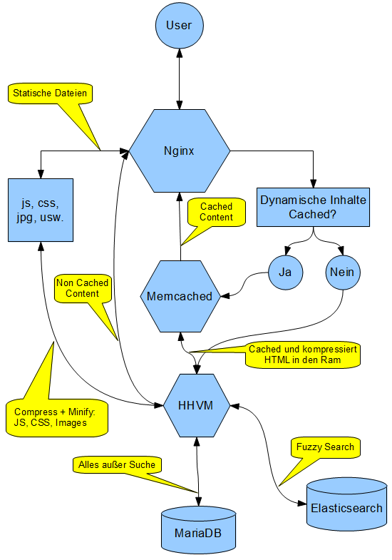

In diesem Beitrag möchte ich eine Anleitung geben, wie man WordPress beschleunigen kann. Der Beitrag richtet sich vor allem an Bastler und System Admins. Die Teile, die sich auf PHP-FPM und Testdaten beziehen dienen lediglich als Referenz zum Testen. Sie können allesamt ausgelassen werden.

Das Endergebnis wird ein gegenüber [diesem Beitrag](/mehr-speed-fuer-wordpress-mittels-fullpage-caching-mit-nginx-und-memcached/ "Mehr Speed für WordPress mittels Fullpage Caching mit Nginx und Memcached") etwas erweiterter Aufbau sein:  

Wir werden uns zu Nutze machen, dass der Webserver **Nginx** direkt mit dem Key Value Store Memcached kommunizieren kann und wir so gecachte Inhalte aus dem Ram an Nginx ausgeliefern können.

Des Weiteren werden wir mittels Plugins HTML, Javascript und CSS komprimieren. Im Fall von Javascript und CSS werden die Inhalte in jeweils eine Datei zusammengefasst werden.

Die Blogsuche wird nicht mehr, wie gewohnt, über den MySQL angebunden, sondern der Suchserver **Elasticsearch** verwendet.

An Stelle von **MySQL** wird auf die Datenbank **MariaDB** gesetzt werden.

Letztendlich werden wir auf die klassischen PHP Interpreter verzichten und die, von Facebooks entwickelte, **Hip Hop Virtual Machine** (kurz **HHVM**) zum Ausliefern von PHP verwenden.

___
Weiter geht es mit [WordPress unleashed: Testsystem](/wordpress-unleashed-testsystem/ "Wordpress unleashed: Testsystem")

### Alle Teile dieser Serie

- [WordPress unleashed: Konzept](/wordpress-unleashed-konzept/ "Wordpress unleashed: Konzept")
- [WordPress unleashed: Testsystem](/wordpress-unleashed-testsystem/ "Wordpress unleashed: Testsystem")
- [WordPress unleashed: LEMP Stack](/wordpress-unleashed-lemp-stack/ "Wordpress unleashed: LEMP Stack")
- [WordPress unleashed: Datenbank + WordPress](/wordpress-unleashed-datenbank-wordpress/ "Wordpress unleashed: Datenbank + WordPress")
- [WordPress unleashed: Memcached + Cachify](/wordpress-unleashed-memcached-cachify/ "Wordpress unleashed: Memcached + Cachify")
- [WordPress unleashed: WordPress unleashed: Autoptimize JS + CSS](/wordpress-unleashed-autoptimize-js-css/ "Wordpress unleashed: WordPress unleashed: Autoptimize JS + CSS")
- [WordPress unleashed: Elasticsearch](/wordpress-unleashed-elasticsearch/ "Wordpress unleashed: Elasticsearch")
- [WordPress unleashed: WordPress Plugins](/wordpress-unleashed-wordpress-plugins/ "Wordpress unleashed: WordPress Plugins")
- [WordPress unleashed: Performance Tests](/wordpress-unleashed-performance-tests/ "Wordpress unleashed: Performance Tests")
- [WordPress unleashed: Nginx absichern](/wordpress-unleashed-nginx-absichern/ "Wordpress unleashed: Nginx absichern")

