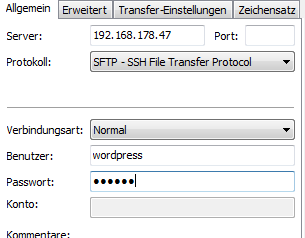

### NGINX

Als erstes installieren wir den Webserver. Zum Einsatz kommt Nginx. Wir werden die [NAXSI](https://github.com/nbs-system/naxsi) Variante installieren, damit wir später beim Absichern des Systems, eine Web Application Firewall (WAF) einrichten können.

```bash
apt-get install nginx-common nginx-naxsi -y
```

Nun den Vhost für FPM einrichten, indem man die Datei **/etc/nginx/sites-available/wordpress.fpm** mit folgendem Inhalt anlegt. Dabei muss die IP angepasst werden:

```
server {
    listen 192.168.178.47:80;

    root /var/www/wordpress/htdocs;
    index index.php index.html index.htm;

    access_log /var/www/wordpress/logs/access.log;
    error_log  /var/www/wordpress/logs/error.log;

    server_name "";

    location / {
        try_files $uri $uri/ /index.php;
    }

    location ~ \.php$ {
        fastcgi_pass unix:/var/run/php5-fpm.sock;
        fastcgi_index index.php;
        include fastcgi_params;
    }
}
```

Der Vhost für HHVM, bei dem die IP ebenfalls angepasst werden muss, in der Datei **/etc/nginx/sites-available/wordpress.hhvm** hat den Inhalt

```
server {
    listen 192.168.178.48:80;

    root /var/www/wordpress/htdocs;
    index index.php index.html index.htm;

    access_log /var/www/wordpress/logs/access.log;
    error_log  /var/www/wordpress/logs/error.log;

    server_name "";

    location / {
        try_files $uri $uri/ /index.php;
    }

    location ~ \.(hh|php)$ {
        fastcgi_keep_conn on;
        fastcgi_pass unix:/var/run/hhvm/server.sock;
        fastcgi_index  index.php;
        fastcgi_param  SCRIPT_FILENAME $document_root$fastcgi_script_name;
        include        fastcgi_params;
    }
}
```

Danach verlinken wir die beiden Vhosts nach **/etc/nginx/sites-enabled/**, um die Konfigurationen zu aktivieren

```bash
ln -s /etc/nginx/sites-available/wordpress.fpm /etc/nginx/sites-enabled/
ln -s /etc/nginx/sites-available/wordpress.hhvm /etc/nginx/sites-enabled/
```

### Ordner und User

Als erstes legen wir die notwendigen Ordner an

```bash
mkdir -p /var/www/wordpress/logs/ /var/www/wordpress/hhvm/ /var/www/wordpress/htdocs/ /var/www/wordpress/sessions/ /var/www/wordpress/tmp/
```

Der dazugehörige User wird beim Anlegen gleich in die **www-data** Gruppe einsortiert und eine invalide Shell gegeben

```bash
useradd -d /var/www/wordpress -s /bin/false -g www-data wordpress
```

Das Passwort, mit dem wir die Dateien mittels SFTP übertragen werden wird folgendermaßen gesetzt

```bash
passwd wordpress
```

Im Anschluss korrigieren wir die Dateirechte. Dabei ist es wichtig, dass der Ordner **chown -R wordpress:www-data /var/www/wordpress/\*** weiterhin dem Root Account gehört.

```bash
chown -R wordpress:www-data /var/www/wordpress/*
```

Dateiübertragungen werden mittels SFTP, getätigt. Damit entfällt die Notwendigkeit, einen FTP Server zu installieren. Jedoch muss der SSH Deamon in der **/etc/ssh/sshd_config** konfiguriert werden, damit der User in seinem Verzeichnis eingesperrt ist. Dort tragen wir ganz am Ende ein

```
Subsystem sftp internal-sftp
Match User wordpress
    ChrootDirectory /var/www/wordpress
    ForceCommand internal-sftp
    AllowTCPForwarding no
    X11Forwarding no
```

*Es ist wichtig, das nach dem Match User Block keine weitere Einstellungen mehr kommen!*

Damit die Änderungen ziehen, starten wir den SSH2 Server neu

```bash
service ssh restart
```

Falls beim Neustart der Fehler `/etc/ssh/sshd_config line 89: Subsystem 'sftp' already defined.`  auftritt, muss noch folgender Eintrag auskommentiert werden

```
#Subsystem sftp /usr/lib/openssh/sftp-server
```

Nun sollte es möglich sein, sich mittels Filezilla, oder WinSCP zu verbinden. Filezilla wäre so ähnlich zu konfigurieren  


### PHP-FPM

Damit wir eine Referenz haben, installieren wir PHP5-FPM

```bash
apt-get install php5-common php5-fpm php5-mysql php5-mcrypt php5-curl -y
```

Danach konfigurieren wir die **/etc/php5/fpm/pool.d/www.conf**  
```
user = wordpress
group = www-data
listen = /var/run/php5-fpm.sock
listen.owner = wordpress
listen.group = www-data
php_admin_value[memory_limit] = 128M
```

und starten *PHP-FPM* neu

```bash
service php5-fpm restart
```

### HHVM

Auf der [Github Seite des HHVM Projekts](https://github.com/facebook/hhvm/wiki/Prebuilt-Packages-on-Debian-7) befindet sich eine Anleitung zum Installieren fertiger Debian Pakete. Die Arbeitsschritte sind

```bash
wget -O - http://dl.hhvm.com/conf/hhvm.gpg.key | apt-key add -
echo "deb http://dl.hhvm.com/debian wheezy main" > /etc/apt/sources.list.d/hhvm.list
apt-get update
apt-get install hhvm
```

Anders, als bei den meisten Tutorials, verbinden wir mit dem Nginx gegen einen Socket. Falls noch nicht vorhanden, legen den Ordner für den Socket an:

```bash
mkdir -p /var/run/hhvm/
```

Danach bearbeiten wir die **/etc/hhvm/server.ini**. Dabei tragen wir den Socket ein und kommentieren den Port aus. Ebenso verlagern wir den Pfad vom Repo:

```
; php options
 
pid = /var/run/hhvm/pid
 
; hhvm specific
;hhvm.server.port = 9000
hhvm.server.file_socket = /var/run/hhvm/server.sock
hhvm.server.type = fastcgi
hhvm.server.default_document = index.php
hhvm.log.use_log_file = true
hhvm.log.file = /var/www/wordpress/logs/error-hhvm.log
hhvm.repo.central.path = /var/www/wordpress/hhvm/hhvm.hhbc
```

### MySQL / MariaDB

An Stelle von MySQL setze ich auf das Drop In Replacement MariaDB. Diese ist in der Version zu 100% kompatibel mit MySQL. Das bedeutet, dass ich nur ein anderes Paket installiere, der Rest, aber wie bekannt abläuft. Eine große Distribution, [die MySQL bereits zu Gunsten von MariaDB ersetzt hat](http://www.computerbase.de/2013-12/red-hat-enterprise-linux-7-beta-tauscht-mysql-gegen-mariadb/), ist RedHat.

Die Installation läuft wie folgt ab

```bash
apt-get install python-software-properties
apt-key adv --recv-keys --keyserver keyserver.ubuntu.com 0xcbcb082a1bb943db
add-apt-repository 'deb http://mirror.netcologne.de/mariadb/repo/5.5/debian wheezy main'
apt-get update
apt-get install mariadb-server
```

___
Weiter geht es mit [WordPress unleashed: Datenbank + WordPress](/wordpress-unleashed-datenbank-wordpress/ "Wordpress unleashed: Datenbank + WordPress")

### Alle Teile dieser Serie

- [WordPress unleashed: Konzept](/wordpress-unleashed-konzept/ "Wordpress unleashed: Konzept")
- [WordPress unleashed: Testsystem](/wordpress-unleashed-testsystem/ "Wordpress unleashed: Testsystem")
- [WordPress unleashed: LEMP Stack](/wordpress-unleashed-lemp-stack/ "Wordpress unleashed: LEMP Stack")
- [WordPress unleashed: Datenbank + WordPress](/wordpress-unleashed-datenbank-wordpress/ "Wordpress unleashed: Datenbank + WordPress")
- [WordPress unleashed: Memcached + Cachify](/wordpress-unleashed-memcached-cachify/ "Wordpress unleashed: Memcached + Cachify")
- [WordPress unleashed: WordPress unleashed: Autoptimize JS + CSS](/wordpress-unleashed-autoptimize-js-css/ "Wordpress unleashed: WordPress unleashed: Autoptimize JS + CSS")
- [WordPress unleashed: Elasticsearch](/wordpress-unleashed-elasticsearch/ "Wordpress unleashed: Elasticsearch")
- [WordPress unleashed: WordPress Plugins](/wordpress-unleashed-wordpress-plugins/ "Wordpress unleashed: WordPress Plugins")
- [WordPress unleashed: Performance Tests](/wordpress-unleashed-performance-tests/ "Wordpress unleashed: Performance Tests")
- [WordPress unleashed: Nginx absichern](/wordpress-unleashed-nginx-absichern/ "Wordpress unleashed: Nginx absichern")

