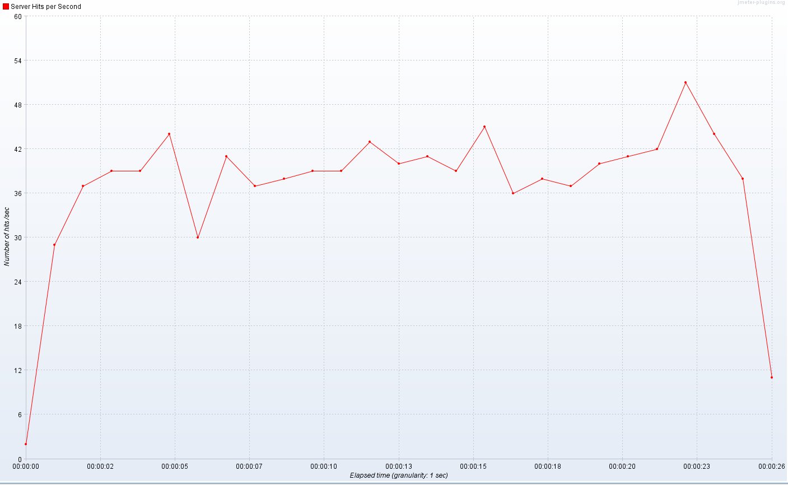

### Performance Tests ohne Cache

Im Folgenden wird ein WordPress Blog ohne jegliche Plugins und Caching getestet. Dies aus dem Grund, weil ich die Performance Unterschiede zwischen PHP-FPM und HHVM darlegen möchte. Dabei ist zu beachten, dass HHVM bereits compilierte Inhalte cacht. Das bedeutet, dass der zweite Testdurchlauf immer deutlich schneller, als der erste sein wird. Die Tests werden von einer zweiten VM bzw. direkt von meinem Desktop gestartet.

#### ApacheBench

Ein einfacher Lasttest kann mit ApacheBench gefahren werden. Dieser ist jedoch nicht in der Lage Last zu erzeugen, der Userverhalten ähnelt. Vielmehr wird eine Bestimmte Seite mit einer zu bestimmenden Anzahl von Anfragen und gleichzeitigen Verbindungen bombardiert. Die Installation läuft mit

```bash
apt-get install apache2-utils
```

Der Aufruf zum Testen der Landing Page ist **ab -k -n 1000 -c 50 http://192.168.178.47/**. Es werden 1000 Aufrufe mit 50 gleichzeitigen Verbindungen gemacht.

Bei PHP-FPM kommt man auf:

```
Time taken for tests:   86.963 seconds
Complete requests:      1000
Failed requests:        0
Write errors:           0
Keep-Alive requests:    0
Total transferred:      59521000 bytes
HTML transferred:       59108000 bytes
Requests per second:    11.50 [#/sec] (mean)
Time per request:       4348.162 [ms] (mean)
Time per request:       86.963 [ms] (mean, across all concurrent requests)
Transfer rate:          668.40 [Kbytes/sec] received

Connection Times (ms)
              min  mean[+/-sd] median   max
Connect:        0    1   2.3      0      12
Processing:   235 4248 517.9   4345    4617
Waiting:      121 4069 512.7   4161    4404
Total:        247 4249 516.0   4345    4618

Percentage of the requests served within a certain time (ms)
  50%   4345
  66%   4385
  75%   4409
  80%   4422
  90%   4460
  95%   4488
  98%   4523
  99%   4555
 100%   4618 (longest request)
```

HHVM im ersten Durchlauf:

```
Time taken for tests:   56.374 seconds
Complete requests:      1000
Failed requests:        0
Write errors:           0
Keep-Alive requests:    0
Total transferred:      59549000 bytes
HTML transferred:       59108000 bytes
Requests per second:    17.74 [#/sec] (mean)
Time per request:       2818.704 [ms] (mean)
Time per request:       56.374 [ms] (mean, across all concurrent requests)
Transfer rate:          1031.56 [Kbytes/sec] received

Connection Times (ms)
              min  mean[+/-sd] median   max
Connect:        0    6  70.3      0     997
Processing:   874 2795 1968.3   2082   11136
Waiting:      866 2737 1931.4   2036   10950
Total:        874 2801 1968.7   2083   11137

Percentage of the requests served within a certain time (ms)
  50%   2083
  66%   2629
  75%   2911
  80%   3223
  90%   4590
  95%   9477
  98%  10464
  99%  10783
 100%  11137 (longest request)
```

HHVM im zweiten Durchlauf, bei dem die Inhalte nun gecacht sind:

```
Concurrency Level:      50
Time taken for tests:   26.080 seconds
Complete requests:      1000
Failed requests:        0
Write errors:           0
Keep-Alive requests:    0
Total transferred:      59549000 bytes
HTML transferred:       59108000 bytes
Requests per second:    38.34 [#/sec] (mean)
Time per request:       1304.018 [ms] (mean)
Time per request:       26.080 [ms] (mean, across all concurrent requests)
Transfer rate:          2229.77 [Kbytes/sec] received

Connection Times (ms)
              min  mean[+/-sd] median   max
Connect:        0    1   1.9      0      11
Processing:   461 1294 228.2   1264    2652
Waiting:      461 1216 186.2   1206    2652
Total:        461 1295 229.1   1265    2652

Percentage of the requests served within a certain time (ms)
  50%   1265
  66%   1358
  75%   1415
  80%   1458
  90%   1557
  95%   1696
  98%   1922
  99%   1993
 100%   2652 (longest request)
```

#### JMeter

Nun geht es daran mittels [JMeter](http://jmeter.apache.org/) ein aussagekräftigeres Test Szenario zu bauen. Ich werde auch hier mit 50 gleichzeitigen Verbindungen arbeiten. Dabei werden verschiedene Teile des Blogs aufgerufen. Die Config könnt ihr [hier downloaden](./jmeter.zip) und für eure Zwecke anpassen.

Das Ergebnis mit JMeter spiegelt im Großen und Ganzen das ApacheBench Ergebnis wider. Durch die genauere Analyse fällt auf, das HHVM deutlich besser skaliert. So kann man sehen, dass bei PHP-FPM die Requests alle relativ gleich lange brauchen, während es unter HHVM je nach Anfragentyp deutliche Unterschiede gibt. Alle Anfragen, die nicht gegen Blog Post und Blog Post Übersichten gehen, sind deutlich schneller, als der Rest.

##### PHP-FPM Ergebnisse


##### HHVM Ergebnisse





### Performance Tests Elasticsearch

Mittels ApacheBench hatte ich vorab einen Test ohne Elasticsearch gegen den HHVM Vhost gefahren. Beide Ergebnisse sind aus dem zweiten Durchlauf. Die Parameter waren **ab -k -n 500 -c 10 http://192.168.178.48/?s=demo**. Man kann sehen, dass Elasticsearch vor allem eine funktionale Erweiterung ist. Erst bei großen Setups, bei denen Suchen, den SQL Server an die Grenzen bringen, kann man durch Elasticsearch an Geschwindigkeit gewinnen.

Mit der normalen WordPress Suche waren es:

```
Time taken for tests:   14.940 seconds
Complete requests:      500
Failed requests:        0
Write errors:           0
Keep-Alive requests:    0
Total transferred:      16269500 bytes
HTML transferred:       16049000 bytes
Requests per second:    33.47 [#/sec] (mean)
Time per request:       298.796 [ms] (mean)
Time per request:       29.880 [ms] (mean, across all concurrent requests)
Transfer rate:          1063.48 [Kbytes/sec] received`

Connection Times (ms)  
 min mean[+/-sd] median max  
Connect: 0 0 0.5 0 10  
Processing: 158 297 22.3 299 360  
Waiting: 157 292 22.2 294 352  
Total: 158 298 22.3 300 361

Percentage of the requests served within a certain time (ms)  
 50% 300  
 66% 307  
 75% 311  
 80% 314  
 90% 321  
 95% 331  
 98% 342  
 99% 350  
 100% 361 (longest request)

Bei der Hinzunahme von Elasticsearch sieht es dann wie folgt aus:  
`
Time taken for tests:   15.344 seconds
Complete requests:      500
Failed requests:        0
Write errors:           0
Keep-Alive requests:    0
Total transferred:      15932000 bytes
HTML transferred:       15711500 bytes
Requests per second:    32.59 [#/sec] (mean)
Time per request:       306.884 [ms] (mean)
Time per request:       30.688 [ms] (mean, across all concurrent requests)
Transfer rate:          1013.97 [Kbytes/sec] received`

Connection Times (ms)  
 min mean[+/-sd] median max  
Connect: 0 0 0.3 0 2  
Processing: 124 305 25.9 306 379  
Waiting: 124 300 25.5 300 374  
Total: 125 306 26.0 306 381

Percentage of the requests served within a certain time (ms)  
 50% 306  
 66% 317  
 75% 322  
 80% 325  
 90% 336  
 95% 346  
 98% 354  
 99% 363  
 100% 381 (longest request)
```

### Benchmark mit Cache von extern

Nachdem ich alle Dienste neu gestartet hatte

```bash
service nginx restart && service memcached restart && service hhvm restart
```

wird abermals ein ApacheBench mit den Parametern **ab -k -n 1000 -c 50 http://192.168.178.48/** gestartet  
```
Time taken for tests:   1.369 seconds
Complete requests:      1000
Failed requests:        0
Write errors:           0
Keep-Alive requests:    1000
Total transferred:      60199000 bytes
HTML transferred:       60050000 bytes
Requests per second:    730.30 [#/sec] (mean)
Time per request:       68.465 [ms] (mean)
Time per request:       1.369 [ms] (mean, across all concurrent requests)
Transfer rate:          42933.07 [Kbytes/sec] received

Connection Times (ms)  
 min mean[+/-sd] median max  
Connect: 0 0 1.9 0 10  
Processing: 2 60 72.2 28 604  
Waiting: 0 44 63.4 13 338  
Total: 2 61 72.4 30 604

Percentage of the requests served within a certain time (ms)  
 50% 30  
 66% 68  
 75% 88  
 80% 99  
 90% 128  
 95% 249  
 98% 334  
 99% 348  
 100% 604 (longest request)
```

### Benchmark mit Cache von intern

Ich kannte die Zahlen von anderen Systemen und bin deswegen etwas ins Grübeln gekommen. Ich vermutete die Netzwerkschnittstelle der Virtualisierung als Flaschenhals und habe die gleiche Benchmark von der VM aus gestartet, auf der auch WordPress läuft. Das Ergebnis war gleich ein ganz anderes. Mit einer Übertragungsrate von ca. 1 GigaByte/S werden deutlich höhere Durchsätze erreicht.  

```bash
ab -k -n 100000 -c 200 http://192.168.178.48/

Time taken for tests: 55.778 seconds  
Complete requests: 100000  
Failed requests: 0  
Write errors: 0  
Keep-Alive requests: 99095  
Total transferred: 6029395475 bytes  
HTML transferred: 6005000000 bytes  
Requests per second: 1792.83 [#/sec] (mean)  
Time per request: 111.556 [ms] (mean)  
Time per request: 0.558 [ms] (mean, across all concurrent requests)  
Transfer rate: 105563.00 [Kbytes/sec] received

Connection Times (ms)  
 min mean[+/-sd] median max  
Connect: 0 0 0.6 0 21  
Processing: 1 111 66.1 94 1148  
Waiting: 0 107 67.1 90 1147  
Total: 1 111 66.1 94 1148

Percentage of the requests served within a certain time (ms)  
 50% 94  
 66% 118  
 75% 139  
 80% 155  
 90% 201  
 95% 225  
 98% 268  
 99% 316  
 100% 1148 (longest request)
```

___
Weiter geht es mit [WordPress unleashed: Nginx absichern](/wordpress-unleashed-nginx-absichern/ "Wordpress unleashed: Nginx absichern")

### Alle Teile dieser Serie

- [WordPress unleashed: Konzept](/wordpress-unleashed-konzept/ "Wordpress unleashed: Konzept")
- [WordPress unleashed: Testsystem](/wordpress-unleashed-testsystem/ "Wordpress unleashed: Testsystem")
- [WordPress unleashed: LEMP Stack](/wordpress-unleashed-lemp-stack/ "Wordpress unleashed: LEMP Stack")
- [WordPress unleashed: Datenbank + WordPress](/wordpress-unleashed-datenbank-wordpress/ "Wordpress unleashed: Datenbank + WordPress")
- [WordPress unleashed: Memcached + Cachify](/wordpress-unleashed-memcached-cachify/ "Wordpress unleashed: Memcached + Cachify")
- [WordPress unleashed: WordPress unleashed: Autoptimize JS + CSS](/wordpress-unleashed-autoptimize-js-css/ "Wordpress unleashed: WordPress unleashed: Autoptimize JS + CSS")
- [WordPress unleashed: Elasticsearch](/wordpress-unleashed-elasticsearch/ "Wordpress unleashed: Elasticsearch")
- [WordPress unleashed: WordPress Plugins](/wordpress-unleashed-wordpress-plugins/ "Wordpress unleashed: WordPress Plugins")
- [WordPress unleashed: Performance Tests](/wordpress-unleashed-performance-tests/ "Wordpress unleashed: Performance Tests")
- [WordPress unleashed: Nginx absichern](/wordpress-unleashed-nginx-absichern/ "Wordpress unleashed: Nginx absichern")

