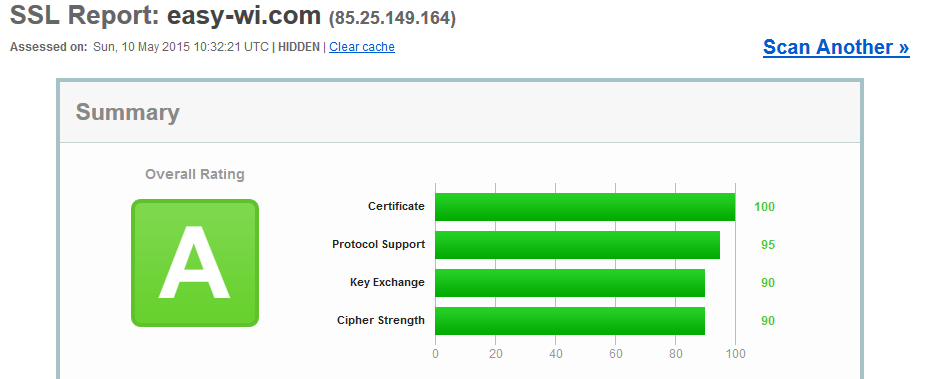

Google hat bereits im [letzten Jahr verkündet](https://www.google.com/events/io?utm_source=wmx_blog&utm_medium=referral&utm_campaign=tls_en_post), dass es in Zukunft eine Verschlüsselung per HTTPS als positiven Ranking Faktor berücksichtigen wird. Dies wird damit begründet, dass Sicherheit oberste Priorität habe und man dem User, das beste, also sichere Ergebnis präsentieren möchte.  
Das bedeutet, dass bei zwei Inhaltlich gleichwertigen Webseiten, diejenige mit HTTPS vor der anderen als Ergebnis angezeigt wird.

Gefordert ist leicht, aber was meint Google damit? Wie sieht es mit der Umsetzung aus? Was muss man dabei berücksichtigen? Wie kann man testen, ob seine Umsetzung erfolgreich ist?

## HTTPS/SSL/TLS

HTTPS ist ein Protokoll zur Datenübertragung im Webbrowser. Es dient zur Verschlüsselung der Datenübertragung. Kommt es nicht zum Einsatz, kann ein Angreifer, alles Übertragende, also auch Passwörter mitschneiden. Dabei reicht es aus, dass man sich in einem öffentlichen WLAN befindet, bei dem der Nachbar ein Lauschprogramm gestartet hat.  
Befindet man sich auf einer gesicherten Seite, wie z.B. <https://easy-wi.com> sieht dies so aus:  


Wenn die Organisation vom Zertifikat Anbieter verifiziert worden ist, erscheint die Leiste in Grün:  


### Was muss ich bei meiner Webseite berücksichtigen?

HTTPS zu konfigurieren ist hauptsächlich eine Arbeit am (Web)Server. Doch auch an der Webseite muss man ggf. Änderungen vornehmen. So muss man sicherstellen, dass die Standard Url auf *https://* konfiguriert ist. Bei WordPress macht man dies unter Einstellungen &gt; Allgemein &gt; WordPress-Adresse (URL)/Website-Adresse (URL).

Je nachdem wie die Webseite aufgebaut ist, muss eventuell zusätzlich man im Quellcode des sicherstellen, dass alle eingebundenen Dateien, wie Javascript, CSS, Bilder ausschließlich über eine Verschlüsselte Verbindung eingebunden werden. Macht man dies nicht, werden diese Inhalte von jedem modernen Browser als Sicherheitsrisiko geblockt.

### Woher bekomme ich ein Zertifikat?

Es gibt nur wenige Zertifikat Autoritäten. Diese werden aber von sehr vielen Resellern vertrieben. Die Preise unterscheiden sich dabei erheblich. Einfache positive Zertifikate können im seltensten Fall kostenlos wie bei [startssl.com](http://www.startssl.com/) beantragt werden. Im Regelfall gehen die Preise zwischen 5-10 US $ bei internationalen Anbietern los. Deutsche Reseller sind oft deutlich teurer.

## Nginx

### Wie richte ich mein Zertifikat ein

Je nach Reseller und Anbieter kann der Prozess für die Zertifikat Dateien sehr Unterschiedlich sein. Am Ende wird aber in aller Regel eine Zertifikats (\*.crt) und eine Key Datei (\*.key) stehen. Als Namen für die Datei verwende ich den Domain Namen. Im Falle von easy-wi.com wären dies dann easy-wi.com.crt und easy-wi.com.key.

Ich arbeite mit Nginx als Webserver und lege deswegen für die Dateien den Unterordner „ssl" im Ordner /etc/nginx/ an:  
`mkdir /etc/nginx/ssl/`

In dem zu verschlüsselnden Vhost werden dann die SSL bezogenen Einträge hinzugefügt. Dabei darf es, im Falle von mehreren Vhosts auf dem Server nur einmal der Eintrag „default" vorkommen:

```
listen 443 default;
ssl on;
ssl_protocols TLSv1 TLSv1.1 TLSv1.2; # Dropping SSLv3, ref: POODLE
ssl_prefer_server_ciphers on;
ssl_certificate /etc/nginx/ssl/domain.tld.crt;
ssl_certificate_key /etc/nginx/ssl/domain.tld.key;
```

Nach dem Eintragen den Nginx noch neu starten mit  
`service nginx restart`

und die Webseite sollte nun unter https://domain.tld erreichbar sein.

### Redirect von HTTP auf HTTPS

Die Webseite/CMS sollte man spätestens jetzt intern auf https umstellen, damit jeder Klick im Menu bzw. die Anweisungen für Suchmaschinen wie die Canonical URL gegen die Verschlüsselten URLs laufen.

Zusätzlich ist es zu empfehlen das Lauschen auf unverschlüsselte Verbindungen für die Webseite zu deaktivieren und durch einen permanenten Redirect zu ersetzen.

```
server {
	listen 80;
	server_name www.domain.tld domain.tld;
	rewrite ^ https://domain.tld$request_uri permanent;
}
```

### HTTP Strict Transport Security 
Man wird im Regelfall nicht um einen Redirect auf Server und Application Ebene herum kommen. Sicherheitstechnisch eröffnet leider nach wie vor einen Angriff durch eine Man in the Middle Attacke. Um diese Gefahr zumindest stark zu reduzieren, wurde HTTP um *HTTP Strict Transport Security* erweitert. Vereinfacht gesagt, sagt man dem Browser, wenn er das erste mal auf einer HTTPS URL landet, dass er den Benutzer ab nun korrigieren soll. D.h. dass der Browser beim nächsten mal, wenn der User HTTP eingibt, diesen automatisch auf HTTPS.

Aktivieren kann man es mit einem Einzeiler:

```
add_header Strict-Transport-Security "max-age=15768000; includeSubDomains";
```

### Perfect Forward Security
Um das Aufdecken von Sicherheitsschlüsseln zu erschweren hat man in moderneren Webservern die Option [Perfect Forward Security](http://de.wikipedia.org/wiki/Perfect_Forward_Secrecy) zu aktivieren.

Als erstes erstellt man sich Diffie-Hellman Parameter:  
`openssl dhparam -out /etc/nginx/ssl/dh4096.pem 4096`

Dann erweitert man seine Konfiguration um die Cypher und den Verweis auf die Datei:

```
ssl_ciphers "EECDH+ECDSA+AESGCM EECDH+aRSA+AESGCM EECDH+ECDSA+SHA384 \
EECDH+ECDSA+SHA256 EECDH+aRSA+SHA384 EECDH+aRSA+SHA256 EECDH+aRSA+RC4 \
EECDH EDH+aRSA RC4 !aNULL !eNULL !LOW !3DES !MD5 !EXP !PSK !SRP !DSS !MEDIUM";
# If you want to ignore older browsers like IE8 you could go with:
# ssl_ciphers "HIGH:!aNULL:!MD5 or HIGH:!aNULL:!MD5:!3DES";
ssl_dhparam /etc/nginx/ssl/dh4096.pem;
```

### SSL Session Cache
Nun noch den SSL Session Cache aktivieren:

```
ssl_session_cache    shared:SSL:10m;
ssl_session_timeout 10m;
```

### Komplettes Beispiel

```
listen 443 default;
ssl on;
ssl_protocols TLSv1 TLSv1.1 TLSv1.2; # Dropping SSLv3, ref: POODLE
ssl_prefer_server_ciphers on;
ssl_certificate /etc/nginx/ssl/domain.tld.crt;
ssl_certificate_key /etc/nginx/ssl/domain.tld.key;

ssl_session_cache shared:SSL:10m;
ssl_session_timeout 10m;
ssl_protocols TLSv1 TLSv1.1 TLSv1.2;
ssl_prefer_server_ciphers on;
ssl_ciphers "EECDH+ECDSA+AESGCM EECDH+aRSA+AESGCM EECDH+ECDSA+SHA384 \
EECDH+ECDSA+SHA256 EECDH+aRSA+SHA384 EECDH+aRSA+SHA256 EECDH+aRSA+RC4 \
EECDH EDH+aRSA RC4 !aNULL !eNULL !LOW !3DES !MD5 !EXP !PSK !SRP !DSS !MEDIUM";
# If you want to ignore older browsers like IE8 you could go with:
# ssl_ciphers "HIGH:!aNULL:!MD5 or HIGH:!aNULL:!MD5:!3DES";
ssl_dhparam /etc/nginx/ssl/dh4096.pem;

add_header Strict-Transport-Security "max-age=15768000; includeSubDomains";
```

### Wie überprüfe ich, ob meine Arbeit erfolgreich war?

Die Einstellungen sind vielfältig. Je nachdem, in welcher Reihenfolge und wo man sie einträgt, kann es passieren, dass sie wieder überschrieben werden. Deswegen sollte man sich nicht auf das Abarbeiten einer Anleitung verlassen, sondern einen Test durchlaufen lassen.

Zum Testen bietet sich das kostenlose Webtool [SSL Test von SSL Labs](https://www.ssllabs.com/ssltest/index.html) an. Hat man alles richtig gemacht, kann das Ergebnis so aussehen:  


