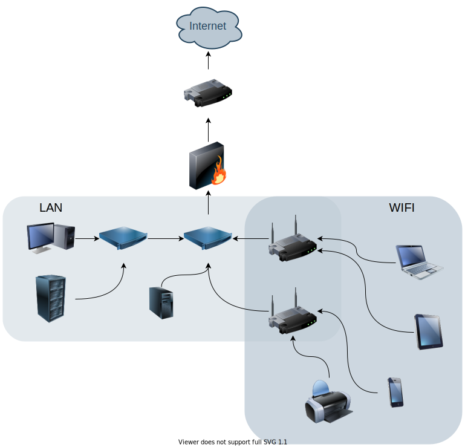
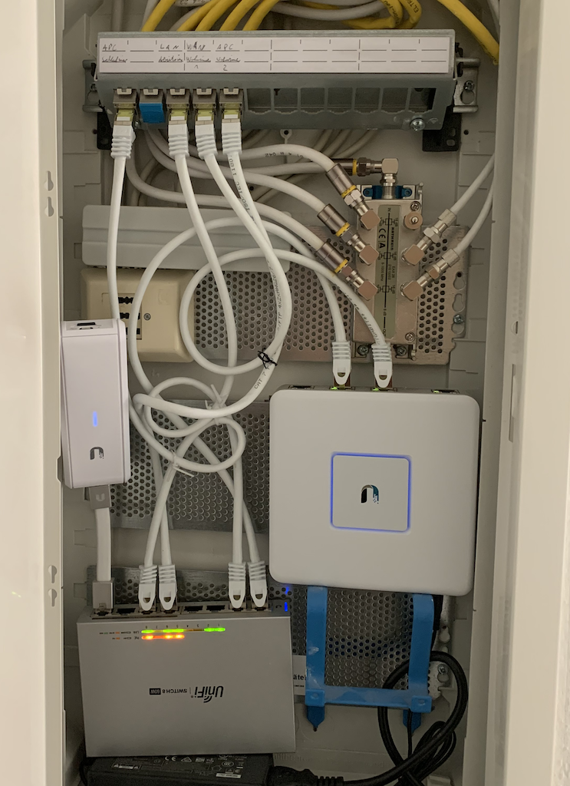

Als wir 2017 in unsere neue Wohnung zusammengezogen sind, habe ich mich auf die kommende Bastelei am Netzwerk gefreut.
Der Vermieter hatte CAT-7 Kabel mit Steckdosen in jedem Zimmer und zentralen [Patch Panel](https://de.wikipedia.org/wiki/Patch_panel) installieren lassen.

## Die Herausforderung

In dem Altbau von 1895 wurden zahlreiche Stahlträger verbaut. Die Wohnung ist in die Länge geschnitten.
So liegen, je nach Position 3-4 Wände zwischen dem WLAN Modem und Empfänger.

Erschwerend kommt hinzu, dass das, vom Anbieter gelieferte Modem, ein nicht sonderlich gutes WLAN Modul besitzt.
Direkt neben dem Fernseher platziert, kommt es regelmäßig zu Abbrüchen der Verbindung.

Am gegenüberliegenden Ende der Verbindung ist die WLAN Verbindung öfter weg, als verfügbar.

## Die vermeintliche Lösung

### Setup

Die erste Idee war der weitgehende Verzicht auf Datenübertragung über WLAN. Dazu sollte die WLAN Reichweite durch einen weiteren Access Point erweitert werden.

Das neu angeschaffte [ASUS RT-AC51U Modem](https://www.asus.com/de/Networking/RTAC51U/) wurde neben dem Patch Panel platziert.
Das Modem des Anbieters wurde über den Uplink angeschlossen. Im Folgenden wurde die SSID und Passwort am RT-AC51U in gleicher Weise, wie beim Anbieter Modem konfiguriert.

Der Fernseher per CAT-6 Kabel an das Modem des Anbieters. Der PC geht mit CAT-6 Kabel an die Multimedia Steckdose, welche in letztendlich mit dem RT-AC51U verbindet.

### Ergebnis

Die Geräte, die kabelgebunden sind, haben keinerlei Netzwerkeinbußen. Auch die Internetnutzung am Handy ist weitestgehend frei von Störungen.

Weniger Erfreulich war das gelegentliche Arbeiten aus dem Home Office. Das CAT-6 Kabel herausholen, Adapter ans MacBook und loslegen.
Der VPN Tunnel in das Corporate Network ist stabil. Das Kabel und der Prozess begann mich zu stören.

Der Versuch das WLAN zusammen, mit dem VPN zu nutzen, war nicht sonderlich erfolgreich.
Das gewählte WLAN Setup verfügt über keine Roaming Eigenschaften. Ob man dann am RT-AC51U oder am Anbieter Modem landet, purer Zufall.
Im Ergebnis war der VPN Tunnel so instabil, dass an Arbeiten über WLAN nicht zu denken war.

## Die Lösung

### Setup

Genervt von den ganzen Problemen habe ich mich entschlossen mit Kanonen auf Spatzen zu schießen. 
Die angeschafften Geräte sind mit einer Ausnahme von [Ubiquiti](https://www.ui.com/).

Vom Anbieter Modem geht es über eine Multimedia Steckdose zum Patch Panel. Von diesem wird die Verbindung in das [UniFi Security Gateway](https://www.ui.com/unifi-routing/usg/) geleitet.

Von hier geht es in einen [UniFiSwitch 8 Desktop Gigabit Managed Switch](https://www.ui.com/unifi-switching/unifi-switch-8/). Er verfügt an 4 Ports über Power over Ethernet.
Diese Ports versorgen drei weitere Geräte mit Strom.

Direkt an den Switch angeschlossen ist der [UniFi Cloud Key](https://www.ui.com/unifi/unifi-cloud-key/). Hier ist die UniFi Controller Software installiert, von der aus das Netzwerk verwaltet wird.

Über das Patch Panel geht es zu zwei WLAN Access Points. Der Erste ist ein [UniFi AP AC Pro](https://www.ui.com/unifi/unifi-ap-ac-pro/) im Wohnzimmer.
Hier und im angeschlossenen Arbeitszimmer befinden sich die meisten WLAN fähigen Geräte.

Auf der anderen Seite der Wohnung im Schlafzimmer ist der zweite WLAN Access Point [UniFi AP AC Lite](https://www.ui.com/unifi/unifi-ap-ac-lite/) 

Zwischen den beiden Access Points gibt es Roaming. Spricht Clients werden Aktiv an den für ihn günstigeren Access Point verwiesen.
Insbesondere, wenn man sich mit dem Handy in der Wohnung bewegt, ist es ein sehr nützliches Feature.

Ein weiterer Switch Port ist zur Multimedia Steckdose im Arbeitszimmer gepatched. Hier ist ein einfacher [Netgear GS305 Switch](https://www.netgear.de/support/product/GS305v2.aspx).
Angeschlossen ein [Raspberry Pi 4](https://www.raspberrypi.org/) und ein PC.

#### Struktur

Die Struktur sieht wie folgt aus:

#### Patch Panel

Am Patch Panel im Netzwerk Kasten ein etwas unprofessionelles Bild:

### Security

Es gibt zwei getrennte WLANs. Eines für IoT Geräte, wie z.B. den Fernseher. Das zweite ist für Handys und Laptops.
Dazu gibt es noch das LAN. Alle drei Netzwerke sind voneinander getrennt.

## Das Ergebnis

Egal, wo man sich in der Wohnung befindet, man hat die volle Bandbreite des Internetanbieters über WLAN.
Der für meine Arbeit so wichtige VPN Tunnel ist absolut stabil