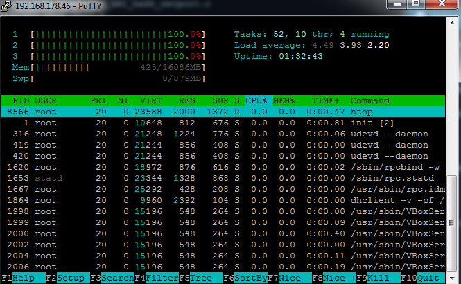

### Einleitung

Dieses How To soll erklären, wie man seinen Rootserver zu einem Gameroot macht, der für den Betrieb von Gameservern optimieren ist. Nicht alles ist zwingend. Vieles sind Denkanstöße die man eventuell für sich anpassen muss. Das hier geschriebene wurde mit Linux Debian getestet, sollte aber auch 1:1 mit Ubuntu funktionieren. CentOS mit *yum* und Suse mit *yast2* verwenden andere Paketmanager und die Pakete heißen etwas anders. Hier kann die passenden Namen mit Tante Google, oder dem *search* Befehl selber herausfinden

```bash
yum search Paketname
```

### Hardware/Leistung bestimmen

Als erstes sollte man sich klar machen, wie viel Leistung und (virtuelle) Kerne man zur Verfügung hat. Diese kann man mit den dem Tool *taskset* einzelnen Prozessen zuweisen und damit die Prozesse einschränken. Verfügt die Intel CPU über Hyperthreading, wie z.B. bei einem Core i7, hat man doppelt so viele virtuelle Kerne, wie man physische verfügt.  
Ruft man das Tool *htop* auf, kann man sehen, wie viele Kerne vorhanden sind. Falls es nicht verfügbar ist, sollte man es noch installieren

```bash
apt-get install htop
```

Auf meinem virtuellen Testserver mit drei Kernen sieht es dann so aus, wenn er unter Vollast steht:  



### Prozesse limitieren

Es ist zwar nicht empfohlen, dass man Gameserver und Webspace auf der gleichen Maschine laufen lässt, für viele ist dies jedoch eine wirtschaftliche Notwendigkeit. In einem solchen Fall kann man die Web- und MySQL bzw. MariaDB Server sowohl in der Anzahl der erlaubten Kerne, als auch in der Priorisierung limitieren.  
Gameserver mittels *taskset* auf einen Kern zu limitieren ist nicht immer förderlich, oft sogar kontraproduktiv.

Zum Einen werden wir mittels *taskset* die Server auf einen Kern limitieren, zum Anderen werden sie mit *nice* und *ionice* unterpriorisiert. Dabei ist zu beachten, dass *taskset* bei 0 mit dem Zählen beginnt. Man hat also bei vier verfügbaren Kernen die Kerne 0,1,2,3 zu vergeben.

Um einen Prozess mit niedrigster Priorität auf dem vierten Kern zu starten, stellt man Folgendes vor den eigentlichen Startbefehl

```bash
taskset -c 3 ionice -n 7 nice -n +19 ./startbefehl
```

Wir bearbeiten nun die Startskripte im */etc/init.d/* Ordner und fügen den obigen Befehl ein. Bei MySQL bzw. MariaDB ist es das Skript */etc/init.d/mysql*, in der man folgende Zeile

```bash
# Start MySQL!
/usr/bin/mysqld_safe > /dev/null 2>&1 &
```

mit dieser austauschen muss

```bash
# Start MySQL!
taskset -c 3 ionice -n 7 nice -n +19 /usr/bin/mysqld_safe > /dev/null 2>&1 &
```

Das gleiche Vorgehen mit Apache2. Hier nennt sich das Startskript */etc/init.d/apache2* und die zu ändernde Zeile ist

```bash
HTCACHECLEAN="$ENV /usr/sbin/htcacheclean"
```

Nach dem Editieren sollte sie so aussehen

```bash
HTCACHECLEAN="taskset -c 3 ionice -n 7 nice -n +19 $ENV /usr/sbin/htcacheclean"
```

Sobald man mit dem Editieren fertig ist startet man die Server neu

```bash
/etc/init.d/apache2 restart
/etc/init.d/mysql restart
```

Nun kann man mittels *ps* die PIDs herausfinden

```bash
ps fx | egrep 'apache|mysql'
11519 pts/1    S+     0:00          \_ egrep apache|mysql
 3630 ?        Ss     0:00 /usr/sbin/apache2 -k start
 4598 pts/1    SN     0:00 /bin/sh /usr/bin/mysqld_safe
 4926 pts/1    SN     0:00  \_ logger -t mysqld -p daemon.error
```

Und dann mit *taskset* überprüfen, ob die Änderungen erfolgreich waren. Die *affinity list* solte den Kernen entsprechen, die man in den Startskripten eingetragen hat.

```bash
taskset -cp 4598
pid 4598's current affinity list: 3
```

### Netzwerkbandbreite limitieren

Ein weiteres Problem kann die Bandbreite der Netzwerkkarte werden. Die meisten Rootserver verfügen über eine Anbindung von 100Mbit an das Internet. Wenn nun mehrere Leute auf den Seiten Surfen und ggf. auch noch ein Fast Download, oder ähnliches über den Webspace läuft, kann es vorkommen, dass mehr Netzwerkbandbreite angefragt wird, als dem Rootserver zur Verfügung steht.

Um diesen Konflikt von vornherein auszuschließen, kann man beim Apache2 Server die insgesamt zulässige Bandbreite mit dem Modul mod-bw limitieren. Das Modul muss erst installiert werden

```bash
apt-get install libapache2-mod-bw
```

Dann aktiviert man es

```bash
a2enmod bw
```

Als letztes geht man daran, die Bandbreite global zu limitieren. Dazu erstellt man die Datei */etc/apache2/conf.d/throttle-bandwidth* und trägt Folgendes ein

```
BandwidthModule On
ForceBandWidthModule On
MaxConnection all 100

# Limitiert auf 1000kb/s
#Bandwidth all 1024000
# Limitiert auf 500kb/s
#Bandwidth all 512000
# Limitiert auf 250kb/s
Bandwidth all 256000
```

Je nach Last können 1000kb und 500kb bereits zu viel sein. Hier gilt es, selber auszuprobieren und den passenden Wert zu finden.

Wenn man die Änderung vorgenommen hat, muss man die Config für den Apachen neu laden

```bash
/etc/init.d/apache2 reload
```

### Eigener Gameserver Kernel

Wer sich nicht zutraut, einen eigenen Kernel zu erstellen, der kann sich [hier](http://www.ulrich-block.de/gameserverkernel/ "Gameserver Kernel") fertige downloaden.

Als erstes bringen wir das System auf den neuesten Stand.

```bash
apt-get update && apt-get upgrade
```

Dann installieren wir die zum Kompilieren notwendigen Pakete:

```bash
apt-get install kernel-package libncurses-dev wget bzip2 make build-essential
```

Durch Abhängigkeiten wird dies eine weit größere Anzahl von Paketen installieren

```
The following extra packages will be installed:
  autopoint dpkg-dev g++ g++-4.7 gettext git git-man intltool-debian libalgorithm-diff-perl libalgorithm-diff-xs-perl
  libalgorithm-merge-perl libcroco3 libcurl3-gnutls libdpkg-perl liberror-perl libfile-fcntllock-perl libgettextpo0 libglib2.0-0
  libglib2.0-data libmail-sendmail-perl librtmp0 libssh2-1 libstdc++6-4.7-dev libsys-hostname-long-perl libtimedate-perl
  libtinfo-dev libunistring0 po-debconf rsync shared-mime-info
```

Wir erstellen ein neues Verzeichnis und wechseln in dieses

```bash
mkdir /root/kernel/
cd /root/kernel/
```

Dann werden die aktuellen Kernel Sourcedateien gedownloaded. Hier NICHT Copy &amp; Paste machen, sondern auf [kernel.org](http://kernel.org "kernel.org") nachschlagen, was das neueste Stable Release ist.

```bash
wget https://www.kernel.org/pub/linux/kernel/v3.x/linux-3.14.1.tar.xz
```

Die heruntergeladene Datei entpacken und in das Verzeichnis wechseln

```bash
tar xfv linux-3.14.1.tar.xz
cd linux-3.14.1
```

Nun weichen wir von den meisten HowTo´s/Tutorials ab und verwenden den *make* Parameter *localmodconfig*. Dadurch werden nur die aktuell verwendeten Module und Treiber für den neuen Kernel übernommen. Wer den Kernel ohne Modul Support bauen möchte, der verwendet den verwandten Parameter *localyesconfig*. Ich bevorzuge die Modulvariante.  
Man wird sehr wahrscheinlich eine Vielzahl von Fragen angezeigt bekommen, die man alle mit Enter bestätigen sollte.

```bash
make localmodconfig
```

Nachdem das Grundgerüst steht, rufen wir die grafische Konfiguration des Kernels auf

```bash
make menuconfig
```

Dort folgende Einstallungen vornehmen:  
General setup -->  
Timers subsystem -->

- Timer tick handling (Full dynticks system (tickless)) -->
- [*] Full dynticks system on all CPUs by default
- [*] Detect full-system idle state for full dynticks system
- [*] Old Idle dynticks config
- [*] High Resolution Timer Support

-*- Enable the block layer -->
IO Schedulers -->

- <*> Deadline I/O scheduler
- <*> CFQ I/O scheduler
- [*] CFQ Group Scheduling support
- Default I/O scheduler (Deadline) -->

Processor type and features -->

- Processor family (Generic-x86-64 für AMD, Core 2/newer Xeon für Inetl)
- Preemption Model (No Forced Preemption (Server)) -->
- Timer frequency (100 HZ) -->
- Default I/O scheduler (Deadline) -->

Wer möglichst viel auf einer Maschine laufen lassen möchte wählt bei Preemtion Model *No Forced Preemption (Server)* aus. Wer den genausten Server für z.B. wenige 128 Tick Warserver haben möchte, der nimmt *Preemptible Kernel (Low-Latency Desktop)*. Das Gleiche gilt für *Timer frequency*. Je genauer der Kernel sein soll, desto mehr HZ sollten eingestellt werden. Große CSS Public Server werden sich hier über den geringeren Overhead von 100HZ freuen, 128 Tick CS:GO Warserver eher über die 1000HZ.

Power management and ACPI options -->  
CPU Frequency scaling -->

- [] CPU Frequency scaling

-*- Networking support -->  
Networking options -->

- [*] Network packet filtering framework (Netfilter)
- [*] QoS and/or fair queueing

Netfilter sind die IPtables. Diese braucht man nicht zwingen. Jedoch wird man als Betreiber von Gameservern früher, oder später von einem DOS, oder sogar DDOS betroffen sein. Während man gegen letzteres auf dem eigenen Root nicht viel machen kann, kann man einen DOS mittels IPtables filtern. Dafür muss der Support dann im Kernel compiliert sein.  
Mittels QoS (Quality of Service) kann man Traffic kategorisieren und priorisieren. Man kann Down und Uploads hinter Gameservertraffik hinten an stellen.

Nachdem alle Einstellungen vorgenommen sind, beenden und speichern wir die Konfiguration und machen uns an das eigentliche Kompilieren.

```bash
make-kpkg clean && make-kpkg -j4 --initrd kernel_image kernel_headers
```

Wenn der Compiler erfolgreich durchgelaufen ist, sollte sich im Order */root/kernel/* der fertige Gameserver Kernel samt Header Dateien als *.deb* Pakete befinden. Diese installieren wir mit dem Tool dpkg. Auch hier bitte gucken, dass man nicht einfach Copy &amp; Paste betreibt, sondern vorher schaut, wie der Kernel eigentlich heißt.

```bash
dpkg -i linux-headers-3.14.1.deb
dpkg -i linux-image-3.14.1.deb
```

Nachdem der Kernel installiert ist, bleibt nur noch das Rebooten:

```bash
reboot
```

Je nach Leistungsstärke des Servers, sollte dieser in einer, oder etwas mehr Minuten wieder erreichbar sein. Mit dem Tool uname kann man überprüfen, ob der neue Kernel geladen wurde

```bash
uname -a
```


### IPTables/Firewall

In meinem Github Repository befindet sich ein fertiges [Skript](https://github.com/ulrichblock/bash-scripts-gameserver/blob/master/iptables.sh) für die IPTables. Je nachdem, welche Ports man belegt hat, muss man es noch anpassen.  
Es sollte in der Lage sein, gängige Arten von DOS Angriffen abzufangen.

Teamspeak 3 Ports werden an dieser Stelle aufgelistet

```bash
TSPORTS=(9987 9988 9989 9990 9991 9992 9993 9994 9995 9996)
```

Gameserver sind hier zu finden

```bash
GSPORTS=(27015 27145 27245)
```

Je nach Traffikaufkommen, kann das Syslog sehr schnell anwachsen. In diesem Fall folgende Zeilen auskommentieren

```bash
#$IPTABLES -I droplog -p TCP -j LOG -m limit --limit 20/min --log-prefix="DROP TCP-Packet: " --log-level crit
#$IPTABLES -I droplog -p UDP -j LOG -m limit --limit 20/min --log-prefix="DROP UDP-Packet: " --log-level crit
#$IPTABLES -I droplog -p ICMP -j LOG -m limit --limit 20/min --log-prefix="DROP ICMP-Packet: " --log-level crit
```